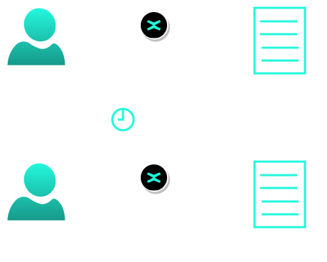

# Decentralized Applications

## Objectives:
* In this lab you will build your first decentralized application (dApp);
* You will create a ping pong application where you will:
    * Create an User Interace (template provided);
    * Login via private key (pem, Chrome extension);
    * Create a Smart contract (template provided);
    * Interact with the User Interace and observe the blockchain transaction;

## dApp Description

The Ping-Pong app is a very simple decentralized application that will allow the user to deposit a specific number of tokens to a smart contract address and to lock them for a specific amount of time.
After this time interval passes, the user can claim back the same amount of tokens.
Sending funds to the contract is called **ping**.
Claiming the same amount back is called **pong**.

## dApp architecture

### Application Layer (The Frontend)

For the web app we'll have two pages:

* The **Sign** in page - here we can authenticate with ledger, web wallet or with xPortal app
* The **Dashboard** page - here we can either ping or pong, if we already deposited, then we will see a countdown timer until the time interval clears out.

### Blockchain Layer (The Backend)

We will create a smart contract that can handle the deposit (**ping**), claim (**pong**) and status actions (**did_user_ping**, **get_time_to_pong**). Let's say that, for now, this smart contract plays the role of an API in a dApp. Also, this is where our business logic resides.

## Step by step tutorial

Please follow the [tutorial](https://docs.multiversx.com/developers/tutorials/your-first-dapp) and create your first dApp.
Interact with the dApp and observe the blockchain transactions.