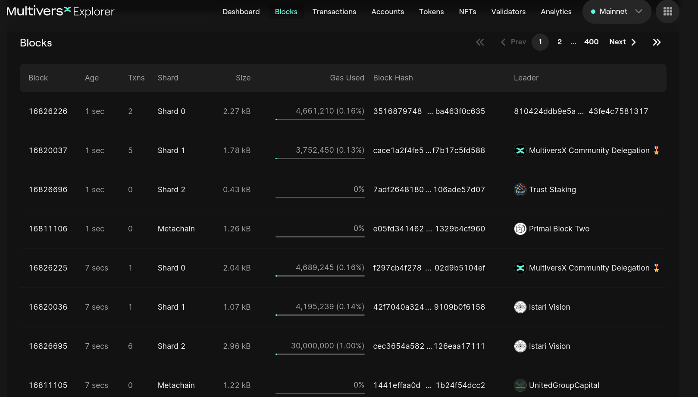
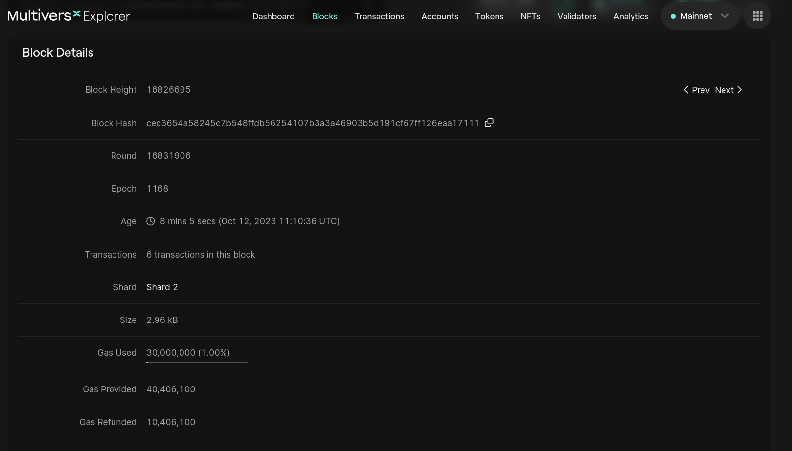

# Blocks in Blockchain

For simplicity, we will use MultiversX blockchain and MultiversX [Explorer](https://explorer.multiversx.com/).

## Notarization of blocks

Inspect the image below:

We can observe 4 blocks from 1 second ago for 4 different shards: Shard0, Shard1, Shard2, Metachain.
These shard a sub-blockchains and enables MultiversX to scale. You can read more about shard [here](https://docs.multiversx.com/technology/adaptive-state-sharding).

We can observe 4 more blocks from 7 seconds ago. That's because each shard outputs a block every 6 seconds.

---
**NOTE**

We previously saw that _every 6 seconds starts new round_, but _not necessarly a new block gets notarized_.
In this case all the blocks successfully passed the consensus round and got notarized.

---

## Block details

[Here](https://explorer.multiversx.com/blocks/cec3654a58245c7b548ffdb56254107b3a3a46903b5d191cf67ff126eaa17111) is the link for one of the blocks in the previous image (Block Height: 16826695).

Observe the block details:
- Round
- Epoch
- Age (timestamp)
- Shard

Based on a simple calculus, the epoch is 1168 which means this blockchain started 3 years and 73 days ago.

We will talk about the other fields in the next section.

## Practice

1. Go to the MultiversX [Explorer](https://explorer.multiversx.com/) and check more blocks from different shard;
2. Go to the Ethereum [Explorer](https://etherscan.io/) and check some blocks details.