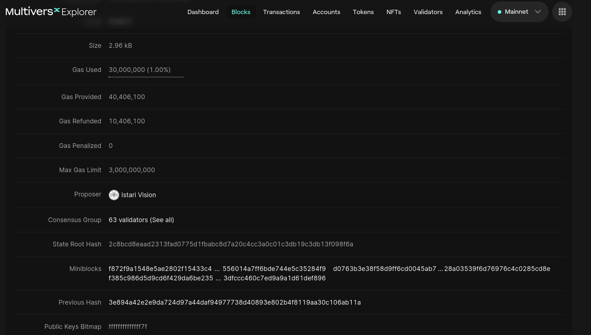
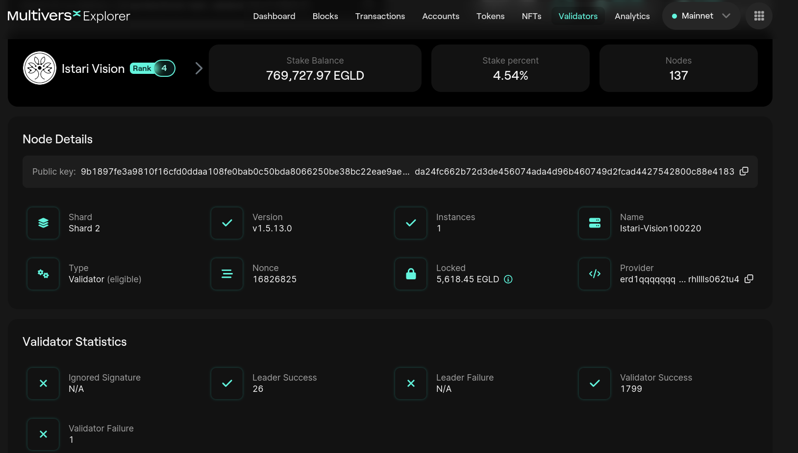

# Blockchain Leader

We will continue with the same [block](https://explorer.multiversx.com/blocks/cec3654a58245c7b548ffdb56254107b3a3a46903b5d191cf67ff126eaa17111) from the previous section (Block Height: 16826695).

We can observe that the **Leader** (also called the **proposer**) is `Istari Vision`.
The leader, also known as the block producer or validator, is responsible for performing several critical tasks within a consensus round:

1. **Block Proposal:** The leader is tasked with proposing a new block containing a set of transactions. This block proposal is the first step in the process of reaching consensus. The leader selects transactions to include in the proposed block and creates a cryptographic hash of the block's contents.

2. **Signature and Verification:** After proposing a block, the leader signs it with their private key to prove its authenticity. Other network participants can verify the leader's signature using their public key. This verification ensures that the proposed block is indeed from the authorized leader.

3. **Broadcasting the Proposal:** Once the block is signed, the leader broadcasts it to the network. Other nodes in the network receive and validate the proposed block to ensure its compliance with the consensus rules.

4. **Agreement and Confirmation:** If the proposed block meets the consensus criteria, it is accepted by the network. The leader's proposed block becomes part of the blockchain, and consensus is achieved for that round.

Let's see some details about this proposer:

We can see his public key, version of the software for the blockchain node and other information we will further discuss.

## Practice

- Open 3 different blocks in 3 different tabs. Observe that every time there is another leader.
Why do you think the system is designed this way?
- Open 3 different blocks in 3 different tabs on Ethereum [Explorer](https://etherscan.io/). Observe that every time there is another leader.