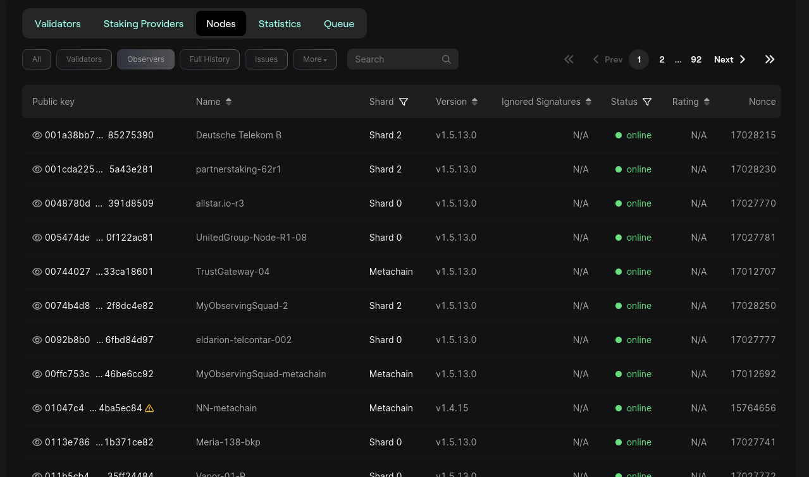

# Blockchain Observers

Observers are a type of nodes that `don't participate in the consensus` but keep a peer-to-peer communication with the rest of the blockchain.
They are usually used to see the communication between nodes (ex: debugging). 

Let's filter the nodes to see only the observers. There is an [Observers](https://explorer.multiversx.com/nodes?type=observer) tab below the `Nodes` section.

We can observer the same fields as the nodes, but there is no `Rating`. Why is that?

Note that each Observer is only on a Shard.

What should we do if we want to listen to the communication on every shard?

Observer that there are other types of nodes