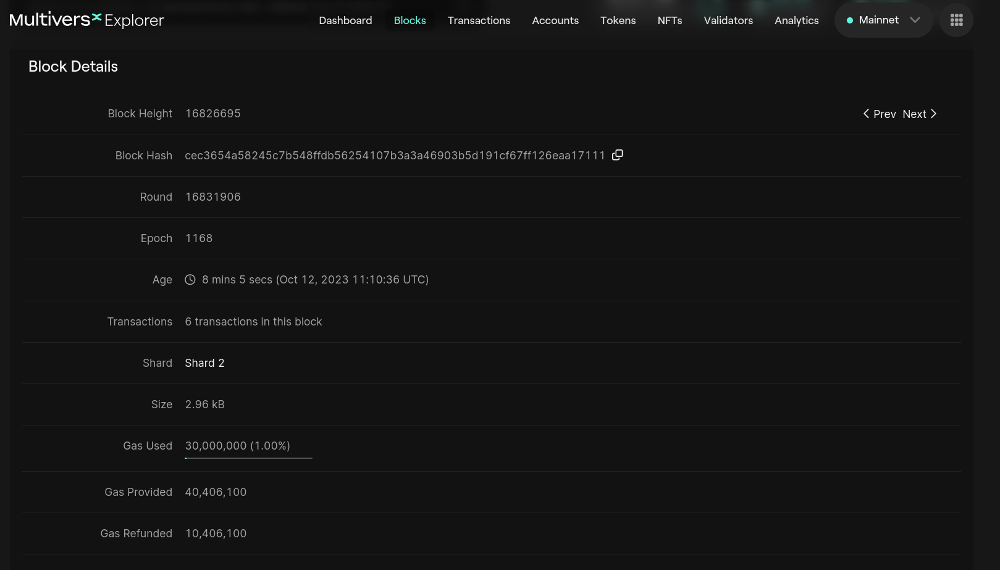

# Transactions

We will continue with the same [block](https://explorer.multiversx.com/blocks/cec3654a58245c7b548ffdb56254107b3a3a46903b5d191cf67ff126eaa17111) from the previous section (Block Height: 16826695).

Observe the field **Transactions**:

We can see that there are 6 transactions in this group.

## Miniblocks

Transactions are grouped in **miniblocks**.
Each miniblock is a category with `Shard_source - Shard_destionation`.

So, for the first miniblock we have 3 transactions from Shard1 to Shard2:

## Transaction details

We will use the first [transaction](https://explorer.multiversx.com/transactions/e988394fa40fb97796f2250c3f33087eba46e3a12ef6d3a0ed3b0dbb2084df18#32cfd2a98e1467aaeac65b9a211cf54bc9453cac0ba64da39a8bf789967bf0a2) from the first miniblock as an example:

Observe the fields:
- Status: Success;
- Age: timestamp;
- Miniblock: the one we previously disscussed about;
- From: The user who created the transaction
- To: The destination of the transaction. This is a smart contract. We will discuss about it in a further section;
- Value: The number of EGLD (MultiversX native token) sent in this transaction

There are more fields in this transaction, but we will discuss about it in a further section.

## Practice

- Open 3 different transactions in 3 different tabs. Inspect the fields.
- Open 3 different transactions in 3 different tabs on Ethereum [Explorer](https://etherscan.io/). Inspect the fields.