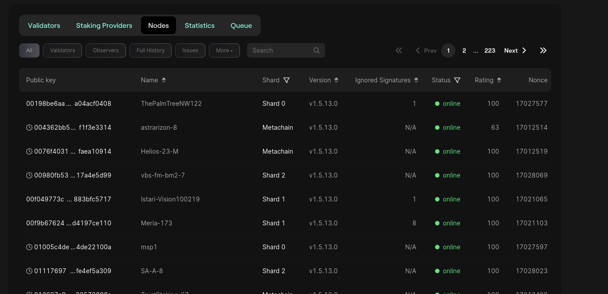
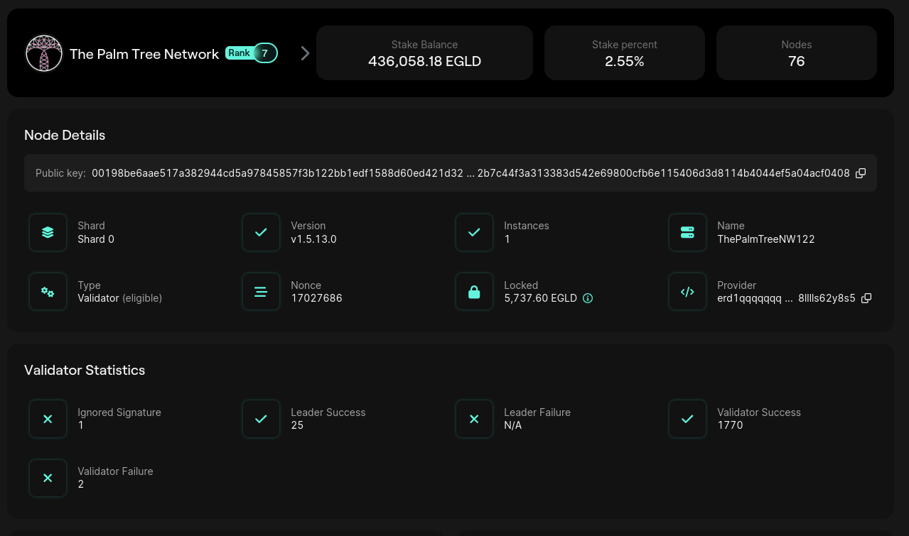

# Blockchain Validators

Every validators/node is publicly displayed on the explorer:
* [MultiverX Validators](https://explorer.multiversx.com/validators);
* [Ethereum Nodes](https://etherscan.io/nodetracker/nodes);
* [Solana Validators](https://solscan.io/validator).

You can check on the explorer the nodes of every blockchain.

---
**NOTE**

We call `nodes` or `validators` the computers who participate in the blockchain to execute transactions.
The more available nodes, the more decentralized the blockchain is.

---

Let's stick to the MultiversX. Go to the [Nodes Section](https://explorer.multiversx.com/nodes).

Observe the nodes public information:
* Public Key
* Name
* Shard
* Node Software Version
* Status
* Rating
* Nonce

We recall that the `Nonce` is the number of transaction that user transmited on the blockchain.

## Rating
Each individual validator has a `Rating` score, which expresses its overall reliability, performance and responsiveness.
When validators join the network immediately after staking, they start with an initial score of `50 points`.

Validators gain or lose rating points in a round depending on their role in that round (consensus proposer vs. consensus validator) and on their behavior within that role.

For the overall health of the network, if the rating of a validator drops below 10 points, it will be `jailed`. Being jailed means that the validator will be taken out of the shards, it will not participate in consensus, and thus it will not earn any rewards.

Rating affects the probability of a validator to be selected in the consensus group of a round. This is done by applying [rating modifiers](https://docs.multiversx.com/validators/rating/#consensus-probabilities) on the probability of selection for each validator.

You can read more on rating shard validators [here](https://docs.multiversx.com/validators/rating/#rating-shard-validators).

## Node details

The explorer offers details on each node participant to the blockchain.

## Practice

- Open 3 different nodes on [MultiversX Explorer](https://explorer.multiversx.com/nodes) and inspect them;
- Open 3 different nodes on [Ethereum Explorer](https://etherscan.io/nodetracker/nodes) and inspect them;
- Open 3 different nodes on [Solana Explorer](https://solscan.io/validator) and inspect them;
