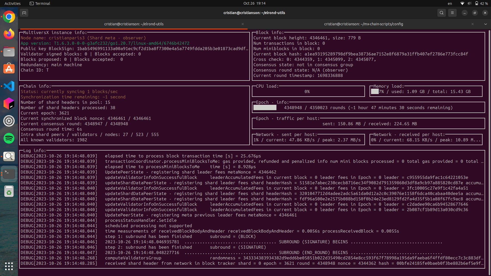

# Setting up an Observer

In this section we will be setting up an Observer on the [MultiversX Testnet](https://testnet-explorer.multiversx.com/).

Clone the installer repository:

```shell
git clone https://github.com/multiversx/mx-chain-scripts
```

Edit `ENVIRONMENT` and `CUSTOM_HOME` in `config/variables.cfg` config file:

```
ENVIRONMENT="testnet"

CUSTOM_HOME="/home/costin"
CUSTOM_USER="costin

```

Don't forget to put your Github Token in the `GITHUBTOKEN` field.
Please check that the `CUSTOM_HOME`` directory exists. 

Run the installation script as follows:

```
./script.sh observing_squad
```

Start the nodes and the Proxy using the command:

```
./script.sh start
```

If you encounter any issue please check the [MultiversX Observing Squad Documentation](https://docs.multiversx.com/integrators/observing-squad/).


## Monitoring and trivial checks

One can monitor the running Observers using the termui utility (installed during the setup process itself in the CUSTOM_HOME="/home/ubuntu" folder), as follows:

```shell
~/elrond-utils/termui --address localhost:8080    # Shard 0
~/elrond-utils/termui --address localhost:8081    # Shard 1
~/elrond-utils/termui --address localhost:8082    # Shard 2
~/elrond-utils/termui --address localhost:8083    # Metachain
```



