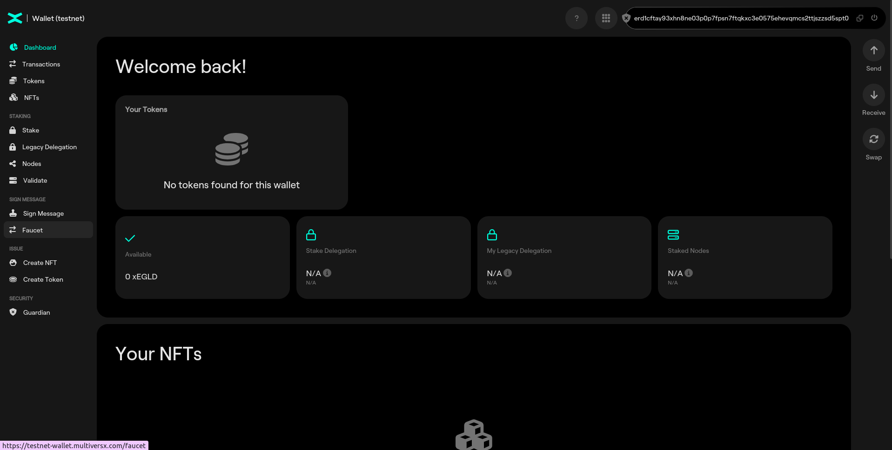
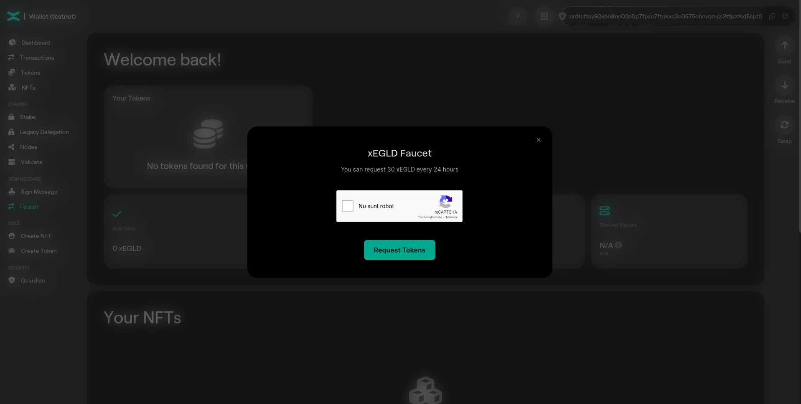

# Access a wallet

Go to [Testnet Wallet](https://testnet-wallet.multiversx.com/) and click on "PEM" (bottom of the screen); click *"Select a file"* and locate your wallet `new_wallet.pem`.

And you’re in! Your EGLD address is on top, you can use the “copy” button (the two rectangles) to copy it to the clipboard.

## Faucet

You can request test tokens from the Faucet tab.

### Practice

Request tokens via Faucet functionality.
