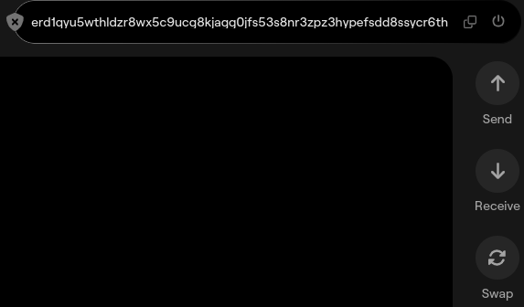
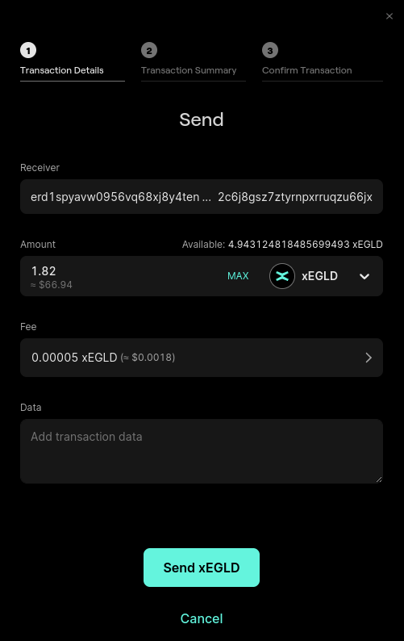
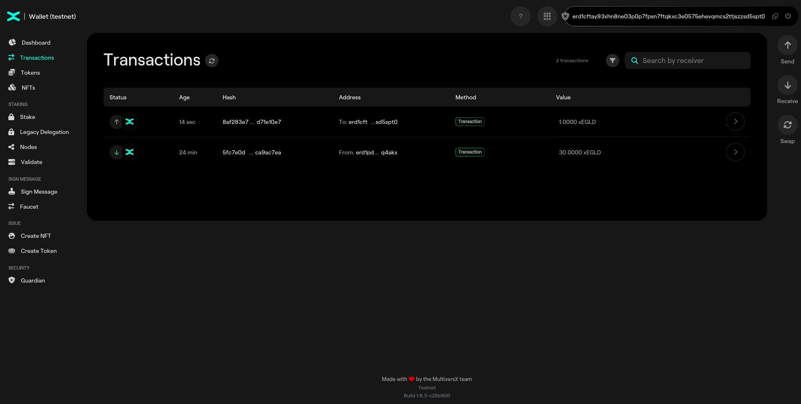
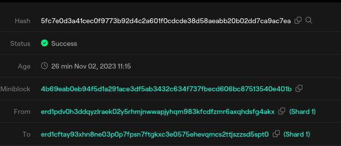

# Send a transaction

Click "Send" on the right-hand section of the wallet:

Input the destination address & amount, and then click "Send".

After confirming the transaction you can see the progress and completion of the transaction.

## Practice

Check transaction history in the "Transactions" menu on the left-hand side of the wallet.

Click on the last transaction (Send Transaction) and check the details.

Open that transaction in the Explorer. At the right hand side of the **Hash** field, click on the magnifier.

