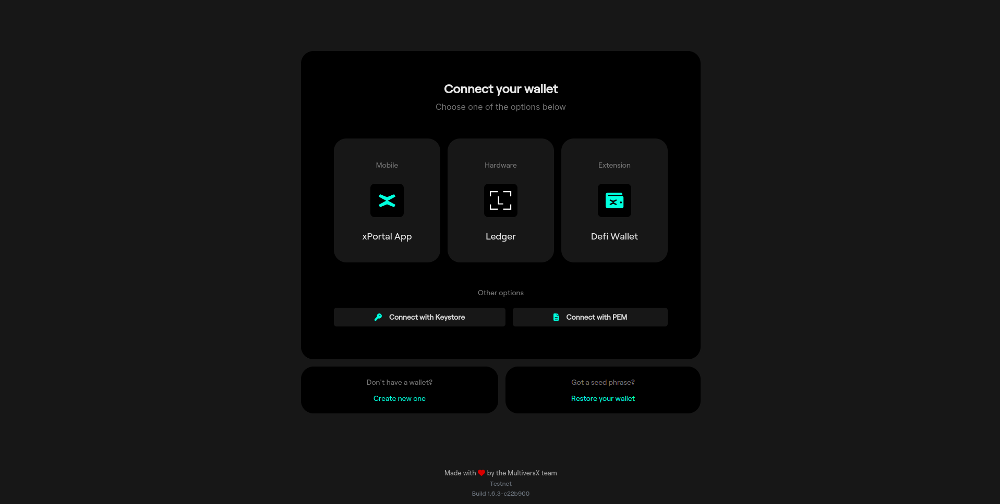
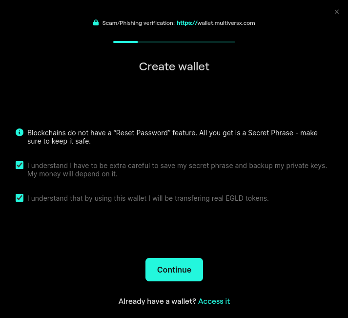
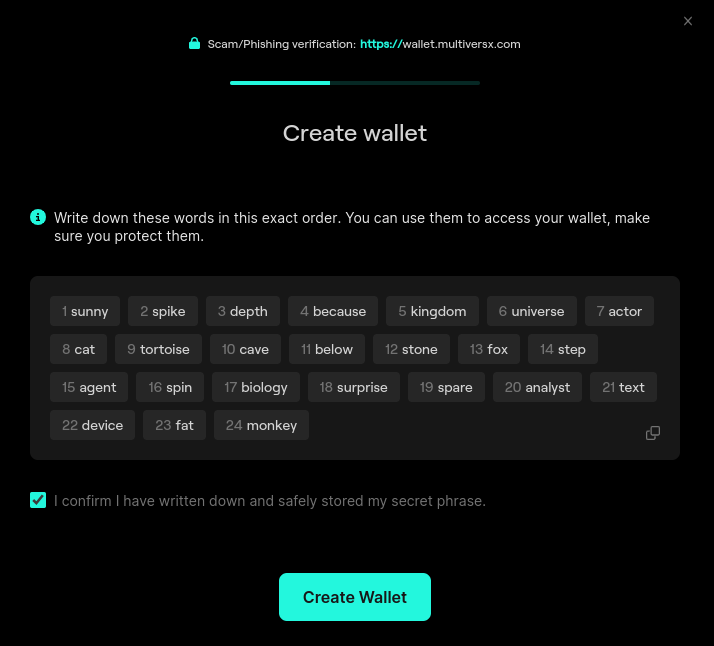
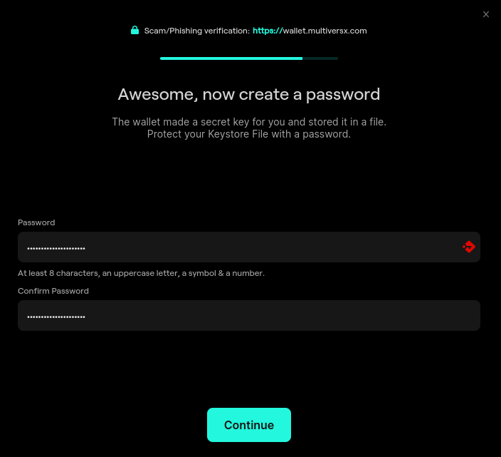

# Setting up a Wallet via Browser

 We will use [MultiversX Testnet Wallet](https://testnet-wallet.multiversx.com/) to participate in the blockchain as a user.

If you already have a wallet, there is no need to create another one.

Go to [MultiversX Testnet Wallet](https://testnet-wallet.multiversx.com/) and create a new wallet by clicking **Create new one**.

Carefully read and acknowledge the information, then click "Continue".

## Save your secret phrase! This is very important

Each wallet will have 24 secret words that can be used for recovery. 

The words, numbered in order, are your Secret Phrase. They are just displayed on your screen once and not saved on a server or anywhere in the world. You only get one chance to save them - please do so now.

Click the “copy” (two rectangles) button and then paste them into a text file. If your pets don’t usually find important pieces of paper to be delicious, you could even write the words down.

The next page is a test to see if you actually have saved the Secret Phrase. Enter the random words as indicated there and press "Continue".

You are one step away from getting your Keystore File. First, encrypt it with a password. 

In case you forget this password, you can get a new Keystore File with your secret phrase. Remembering it is always better.

Congratulations, you have a new wallet! The associated Keystore File was downloaded to wherever your browser saves files by default. The file has the actual address of the wallet as default name, something like “erd….json”. You can rename it to “something.json” so it’s easier to manage, if you want.)
