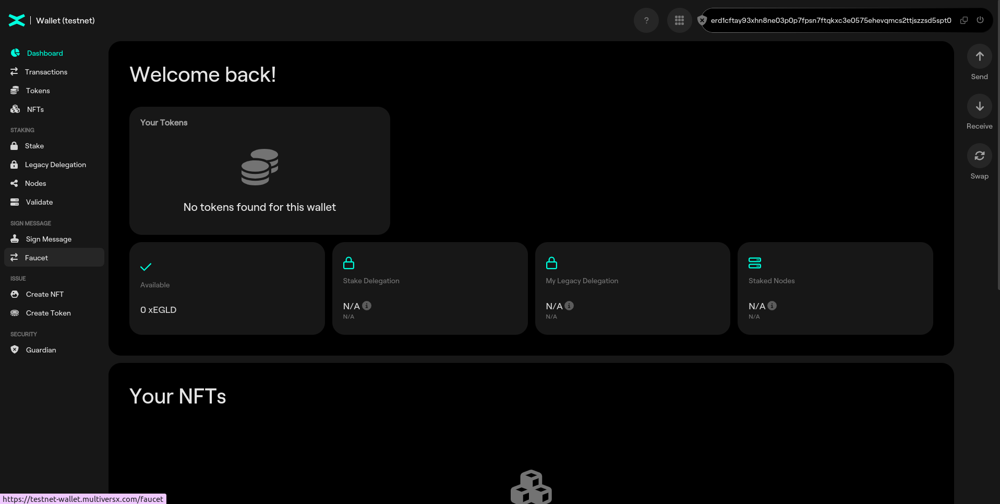
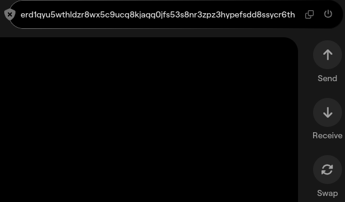
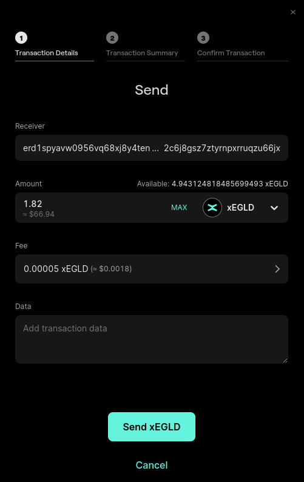
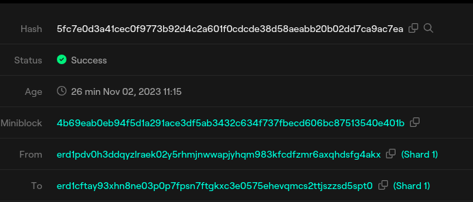

# Setting up a Wallet

 We will use [MultiversX Testnet Wallet](https://testnet-wallet.multiversx.com/) to participate in the blockchain as a user.

Go to [MultiversX Testnet Wallet](https://testnet-wallet.multiversx.com/) and create a new wallet by clicking **Create new one**.


Carefully read and acknowledge the information, then click "Continue".


## Save your secret phrase! This is very important

Each wallet will have 24 secret words that can be used for recovery. 

The words, numbered in order, are your Secret Phrase. They are just displayed on your screen once and not saved on a server or anywhere in the world. You only get one chance to save them - please do so now.

Click the “copy” (two rectangles) button and then paste them into a text file. If your pets don’t usually find important pieces of paper to be delicious, you could even write the words down.


The next page is a test to see if you actually have saved the Secret Phrase. Enter the random words as indicated there and press "Continue".

You are one step away from getting your Keystore File. First, encrypt it with a password. 


## Keystore files

The MultiversX keystore is a JSON file that holds a mnemonic (seed phrase), encrypted with a password (as chosen by the user). Thus, the keystore provides users with a reliable and convenient method for managing their hot wallets and protecting their assets.

Here is an example of a MultiversX Keystore:

```json
{
    "version": 4,
    "id": "5b448dbc-5c72-4d83-8038-938b1f8dff19",
    "kind": "mnemonic",
    "crypto": {
        "ciphertext": "6d70fbdceba874f56f15af4b1d060223799288cfc5d276d9ebb91732f5a38c3c59f83896fa7e7eb6a04c05475a6fe4d154de9b9441864c507abd0eb6987dac521b64c0c82783a3cd1e09270cd6cb5ae493f9af694b891253ac1f1ffded68b5ef39c972307e3c33a8354337540908acc795d4df72298dda1ca28ac920983e6a39a01e2bc988bd0b21f864c6de8b5356d11e4b77bc6f75ef",
        "cipherparams": {
            "iv": "2da5620906634972d9a623bc249d63d4"
        },
        "cipher": "aes-128-ctr",
        "kdf": "scrypt",
        "kdfparams": {
            "dklen": 32,
            "salt": "aa9e0ba6b188703071a582c10e5331f2756279feb0e2768f1ba0fd38ec77f035",
            "n": 4096,
            "r": 8,
            "p": 1
        },
        "mac": "5bc1b20b6d903b8ef3273eedf028112d65eaf85a5ef4215917c1209ec2df715a"
    }
}
```

At first, you will see an unappealing JSON file, which appears to contain magic parameters used for numerous complex cryptographic operations with unclear and vague purpose. But if you dig a little deeper you will see that it contains:

kind - Can be secretKey or mnemonic and represents the input to be encrypted using the cipher;
ciphertext - Your MultiversX mnemonic or secret key encrypted using the cipher algorithm below;
cipher - The name of a symmetric AES algorithm;
cipherparams - The parameters required for the cipher algorithm above;
kdf - A key derivation function used to let you encrypt your keystore file with a password;
kdfparams - The parameters required for the kdf algorithm above;
mac - A code used to verify your password.
Keystore files created with the first major version of the web wallet (available prior February 14th, 2023) hold the encrypted secret key, instead of the encrypted mnemonic (as the new keystore files do). Though the older files are still compatible with the new web wallet - compatibility is achieved through the aforementioned "kind" field.

When kind is set (or not set at all) to secretKey, the ciphertext field will contain the encrypted secret key, as it did before. However, when kind is set to mnemonic, the ciphertext field will contain the encrypted mnemonic instead.

Auxiliary reference: [ERC-2335: BLS12-381 Keystore](https://eips.ethereum.org/EIPS/eip-2335).


## Access a wallet

Go to [Testnet Wallet](https://testnet-wallet.multiversx.com/) and click on "Connect with Keystore"; click Browse and locate your Keystore File [erd1… .json], then put in your password and click "Access Wallet".



And you’re in! Your EGLD address is on top, you can use the “copy” button (the two rectangles) to copy it to the clipboard.

## Faucet

You can request test tokens from the Faucet tab.


### Practice

Request tokens via Faucet functionality

## Send a transaction

Click "Send" on the right-hand section of the wallet:



Input the destination address & amount, and then click "Send".




After confirming the transaction you can see the progress and completion of the transaction.


### Practice

Check transaction history in the "Transactions" menu on the left-hand side of the wallet.


Click on the last transaction (Send Transaction) and check the details.

Open that transaction in the Explorer. At the right hand side of the **Hash** field, click on the magnifier.



### Bonus

Deploy an observing squad and check your transaction.

## Browser Wallet Extension


The MultiversX DeFi Wallet can be installed on Firefox, Chrome, Brave, and other chromium-based browsers. This extension is free and secure, with compelling features that allow you to create a new wallet or import existing wallets, manage multiple wallets on the MultiversX mainnet, and store MultiversX tokens such as EGLD, ESDT, or NFTs on the MultiversX Network with easy accessibility.

Follow the tutorial [here](https://docs.multiversx.com/wallet/wallet-extension) to install a Browser extension.