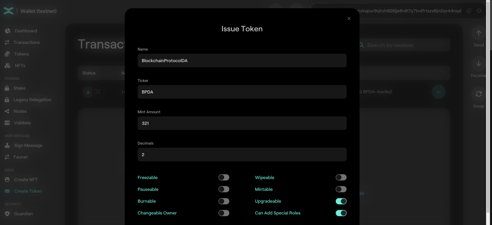
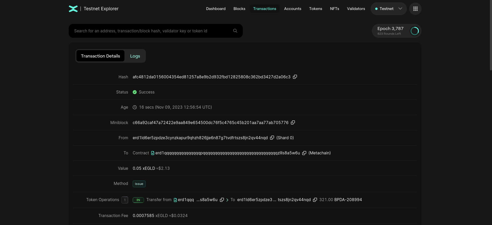
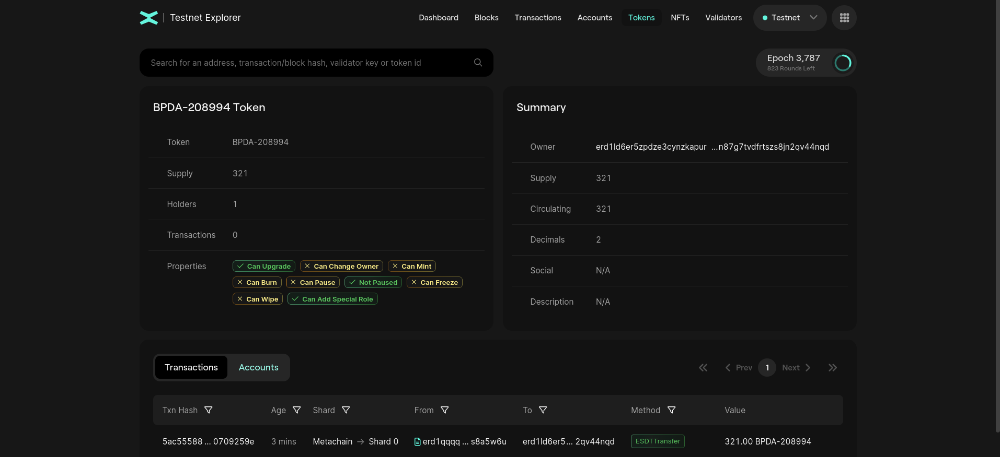

# Mint tokens

In this section you will learn how to mint tokens on MultiversX.

There are 2 types of tokens on MultiversX:
* Native tokens - EGLD;
* ESDT - eStandard Digital Token.

In the previous section you learnt how to mint xEGLD on [MultiversX Testnet](https://testnet-wallet.multiversx.com/) using `Faucet` option.

## Mint ESDT

This time we use the `Create Token` option.

Token Name:
* length between 3 and 20 characters
* alphanumeric characters only

Token Ticker:
* length between 3 and 10 characters
* alphanumeric UPPERCASE only

Number of decimals:
* should be a numerical value between 0 and 18;
* there are no floats on the blockchain;
* a token with 3 decimals and value 1000 would be equal with value 1;
* EGLD has 18 decimals and the value of 1000000000000000000 is 1 EGLD.

Let's create a token new token:

and inspect the transaction.

Observe `Token Operations` field. We received `321.00 BPDA-208994` tokens. `BPDA-208994` is the **token ID**. The token ID is formed by appending to the token ticker the character **-** and 6 random hexadecimals characters. This is done because there might be mutiple tokens with the same ticker; the token ID is always unique.

We can click on the token ID and see the details of the token:

Observe the fields **TOKEN**, **Supply**, **Holders**, **Transactions**, **Owner**, **Decimals**.

Let create another token with the same input:

Observe that the token ID is different.

## Practice

* Create your own ESDT token;
* Inspect the transaction;
* Send some of your tokens to **erd1mqa9wttlzwwdvwgk9dzsfdn79lv5raw0tfe9ynvn0dg92hpruvaqhhd2gx**;
* Create another token with the same ticker. Observer that the token ID is different and unique.