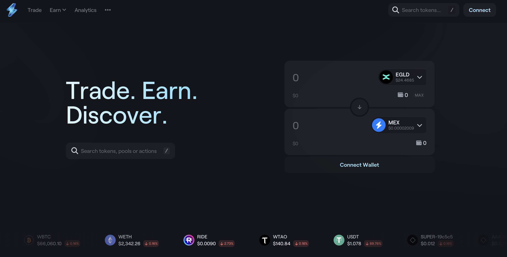
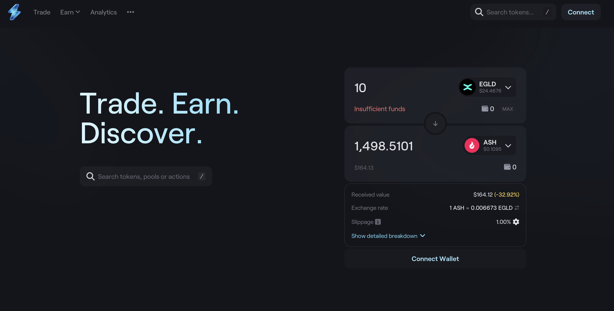
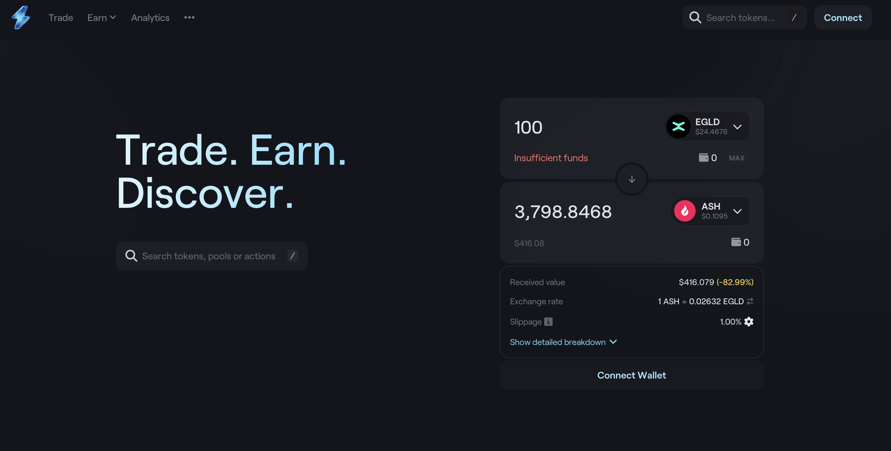
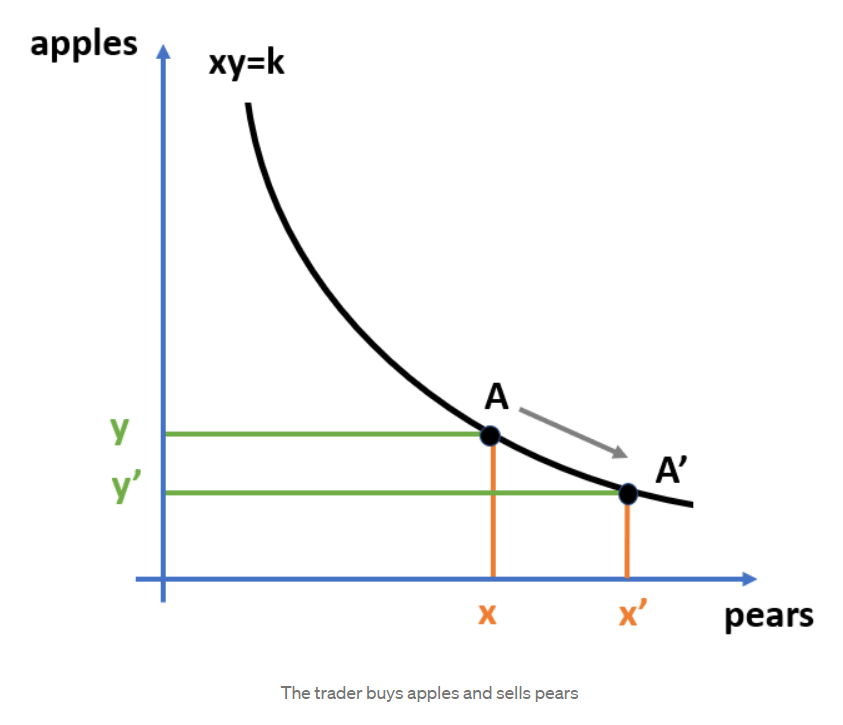
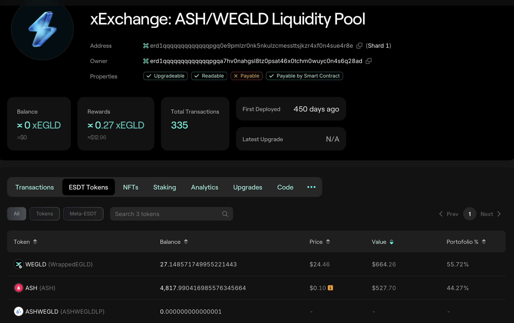
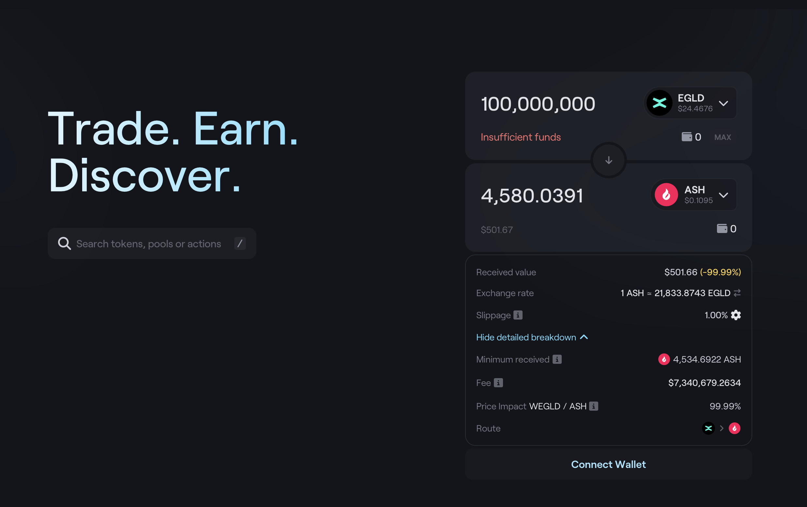

# Swap tokens on xExchange

In this section, you will learn how to swap a token with another on MultiversX. For this, we will use the [Devnet xExchange](https://devnet.xexchange.com/), a MultiversX Decentralized Exchange.

Keep in mind that Devnet and Testnet chains are different! First go to [Devnet Wallet](https://devnet-wallet.multiversx.com) and use **Faucet** functionality to get xEGLD. 

Use **Connect** button and connect with your wallet via your preferred method.

Let's perform a swap from EGLD to ASH.

Notice that for 1 EGLD, we would get **212 ASH** tokens.

Let's try to swap more:

Notice that for 10 EGLD, we would get 1498 ASH tokens.
That's **149.8 ASH** tokens for 1 EGLD.

Any intuition of why the drop of exchange rate?

Let's try to swap more:

Notice that for 100 EGLD, we would get 3798 ASH tokens.
That's **37.98 ASH** tokens for 1 EGLD.

## Automated Market Maker (AMM)

An AMM relies on a mathematical formula to price assets.
Instead of using an order book like a traditional exchange, assets are priced according to a pricing algorithm.

This formula can vary with each protocol.
For example, xExchange DEX uses the industry standard "x*y=k" constant product AMM model, which has proven its reliability in existing implementations, and has been formally modelled and verified.
In this formula, k is a fixed constant, meaning the pool’s total liquidity always has to remain the same.

## Pair Smart Contract 

The smart contract code can be found [here](https://github.com/multiversx/mx-exchange-sc/tree/main/dex/pair).

Let's inspect the deployed [contract](https://devnet-explorer.multiversx.com/accounts/erd1qqqqqqqqqqqqqpgq0e9pmlzr0nk5nkulzcmessttsjkzr4xf0n4sue4r8e/tokens).

Notice the contract's balance:
* WEGLD: 27.14
* ASH: 4,817.99
* ASHWEGLD: 0.000000000000001 - This is the token provided to liquidity providers when they add liquidity. Let's ignore this for now.

Let's try to exchange more ASH than the contract can provide:

In this example, we tried to exchange **100 millions EGLD**, but the contract would output **4,580.0391 ASH** tokens.
That's because of the curve of **x*y=k** formula (see image above).

## Task
Perform a swap. Go to the [Explorer](https://devnet-explorer.multiversx.com) and inspect your transaction.
Inspect if there are any evets emitted.
