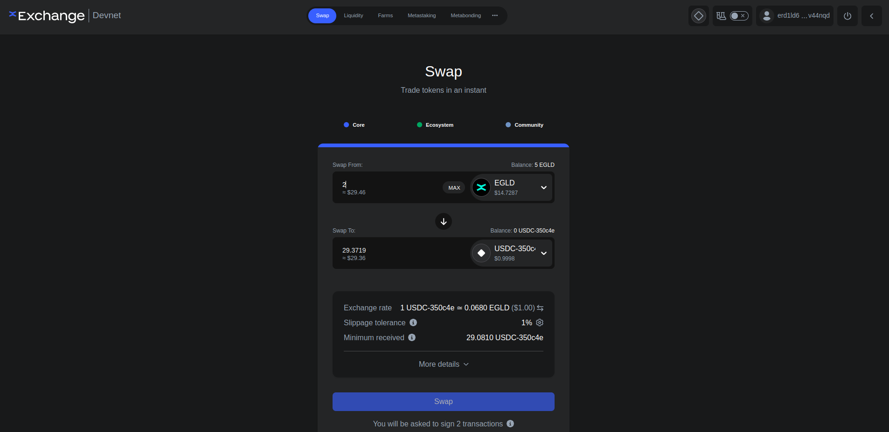

# Swap tokens on xExchange

In this section, you will learn how to swap a token with another on MultiversX. For this, we will use the [Devnet xExchange](https://devnet.xexchange.com/), a MultiversX Decentralized Exchange.

Keep in mind that Devnet and Testnet chains are different! First go to [Devnet Wallet](https://devnet-wallet.multiversx.com) and use **Faucet** functionality to get xEGLD. 

Use **Connect** button and connect with your wallet via your preferred method.
After connection go to the **Swap** tab (it's located on the top of the page).

Select **USDC** and click **Swap**. Check the transaction on the Explorer. Check your balance on your Wallet.