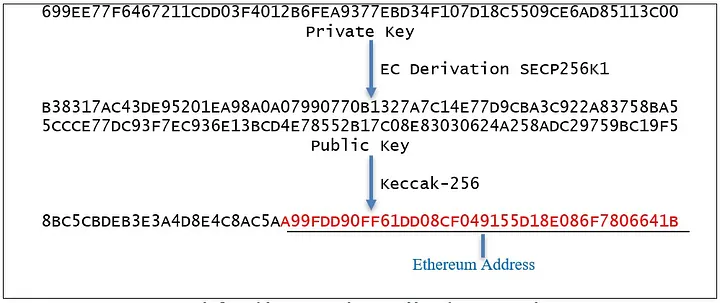
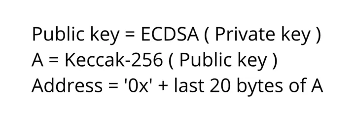
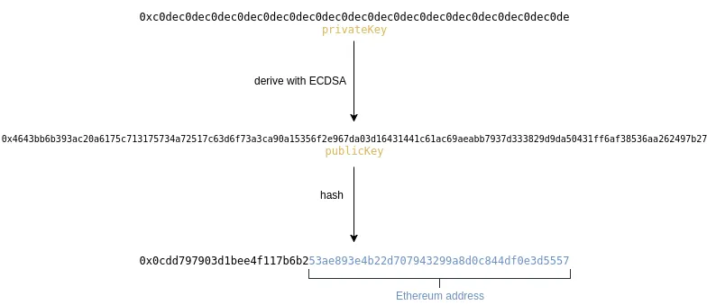
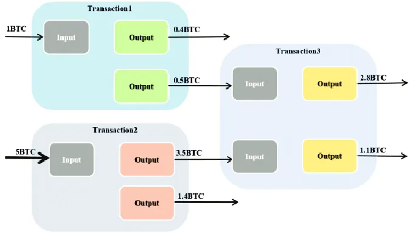

# Basic Wallet 




To create a public key with which we can display our financial gain in the internet we need first to generate a private key using an algorithm, the private key will generate the public key and…from now on we can apply a hash on it and remove some character from behind and add 0x in front to know that this is a public address.




```
/function to create a public and private key
func CreateKeyPair() (crypto.PrivKey, crypto.PubKey, error) {
 //   Create a private and public key pair
 priv, pub, err := crypto.GenerateKeyPair(crypto.RSA, 2048)
 if err != nil {
  return nil, nil, err
 }

 return priv, pub, nil
}

func CreatePairPublicPrivateKey() ([]byte, []byte) {

 //create a private and public key
 priv, pub, err := CreateKeyPair()
 if err != nil {
  panic(err)
 }

 //convert private key to bytes
 privBytes, err := crypto.MarshalPrivateKey(priv)
 if err != nil {
  panic(err)
 }

 //convert public key to bytes
 pubBytes, err := crypto.MarshalPublicKey(pub)
 if err != nil {
  panic(err)
 }

 //list of bytes to string
 privString := hex.EncodeToString(privBytes)
 pubString := hex.EncodeToString(pubBytes)

 //create a wallet variable
 wallet := types.Wallet{
  PrivateKey: []byte(privString),
  PublicKey:  []byte(pubString),
 }
 //convert wallet to bytes marshal
 walletBytes, _ := json.Marshal(wallet)

 //put wallet in the db
 fileop.PutInDB("db/usr", []byte("wallet1"), walletBytes)

 return []byte(pubString), []byte(privString)

} 

```

For generating privateKey and publicKey we will use RSA because is very common and is easy to understand then we store the data into a wallet struct and the struct will be stored on our local storage.

So well we will mine a block we will get the first transaction from coinbase


```
{"BlockNumber":0,
"Time":1668970059,
"Hash":"06c6836e73c1676d58f938fd17a91224b50e5de97623dcc80c4f48d6eb96e052",
"Inputs":[{"Txid":0,"Value":1,"Signature":"","PubKey":"coinbase"}],
"Outputs":[{"Txid":0,"Value":1,"PubKeyHash":"0x2432\n","Signature":""}]
}

```

Every input and output transactions will be signed, so this will be saw by everyone from the blockchain, we will cache this on our wallet because we will be easy when we want to create a transaction.

In bitcoin there isn’t the idea of a balance like having 200 bitcoin, when you send a transaction you also send how you get that money.(we can see how the money where spent.




Our wallet when is creating transaction 3 will say the input from transaction1 and transaction2 and the the outputs like in the json above.

Here is an example of a real bitcoin transaction. Also you signed with your private key what you send to the other peers.

```

{
    "txid": "1b3cb78e7d6cad2cc2050e6dccc2bd5845e98f598062d19fbda8e0a3b5b4b0e6",
    "hash": "9d046215268a1d8031c6b4835a68c9c8c6984b576dc82ec37f859e636ec6e660",
    "version": 1,
    "size": 368,
    "vsize": 341,
    "weight": 1364,
    "locktime": 1064830807,
    "vin": [
        {
            "coinbase": "039ea80b2cfabe6d6df2adbfb95872a2c4bf41bd0af61255f06bc31f0aa11d1c2b11fe673f0a94af3e10000000f09f909f092f4632506f6f6c2f73000000000000000000000000000000000000000000000000000000000000000000000005001d000000",
            "txinwitness": [
                "0000000000000000000000000000000000000000000000000000000000000000"
            ],
            "sequence": 0
        }
    ],
    "vout": [
        {
            "value": 6.28864092,
            "n": 0,
            "scriptPubKey": {
                "asm": "OP_DUP OP_HASH160 c825a1ecf2a6830c4401620c3a16f1995057c2ab OP_EQUALVERIFY OP_CHECKSIG",
                "hex": "76a914c825a1ecf2a6830c4401620c3a16f1995057c2ab88ac",
                "address": "1KFHE7w8BhaENAswwryaoccDb6qcT6DbYY",
                "type": "pubkeyhash"
            }
        },
        {
            "value": 0,
            "n": 1,
            "scriptPubKey": {
                "asm": "OP_RETURN aa21a9ed7c2862196195aa9d4d8b947653d3548ffe4c111d5669a6ec2c96f12f91672884",
                "hex": "6a24aa21a9ed7c2862196195aa9d4d8b947653d3548ffe4c111d5669a6ec2c96f12f91672884",
                "type": "nulldata"
            }
        },
        {
            "value": 0,
            "n": 2,
            "scriptPubKey": {
                "asm": "OP_RETURN 48617468cd302e8d060f04304c01afa1fd1a73a8538f6eee545aa1c0a97e54fa4db86856",
                "hex": "6a2448617468cd302e8d060f04304c01afa1fd1a73a8538f6eee545aa1c0a97e54fa4db86856",
                "type": "nulldata"
            }
        },
        {
            "value": 0,
            "n": 3,
            "scriptPubKey": {
                "asm": "OP_RETURN 52534b424c4f434b3a8350e01a86adc281c624fc5e9e1ba740ac5c1a38c0413a51b5ab342800498b80",
                "hex": "6a4c2952534b424c4f434b3a8350e01a86adc281c624fc5e9e1ba740ac5c1a38c0413a51b5ab342800498b80",
                "type": "nulldata"
            }
        }
    ]
}  
```

This is our code for the signing of the transactions.

```
func SingUsingKey(privateKey []byte, publicKey []byte, data []byte) []byte {
 if GetPrivateKeyAndValidatePublicKey(publicKey) {
  //decode private key
  privKeyBytes, _ := hex.DecodeString(string(privateKey))
  //unmarshal private key
  privKey, err := crypto.UnmarshalPrivateKey(privKeyBytes)
  if err != nil {
   log.Printf("Error unmarshalling private key: %s", err)
   return nil
  }

  //sign data
  signature, err := privKey.Sign(data)
  if err != nil {
   log.Printf("Error signing data: %s", err)
   return nil
  }

  return signature

 } else {
  fmt.Println("Public key does not match private key")
  return nil
 }

}

func VerifySign(signature []byte, publicKey []byte, data []byte) bool {

 pubKey, err := crypto.UnmarshalPublicKey(publicKey)
 if err != nil {
  log.Printf("Error unmarshalling public key: %s", err)
  return false
 }

 //verify signature
 verify, err := pubKey.Verify(data, signature)
 if err != nil {
  return false
 }

 return verify
}

```