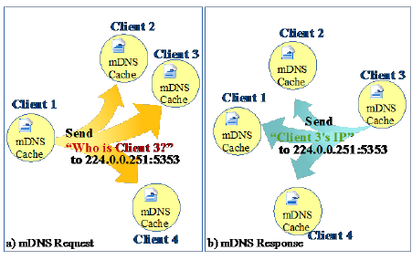
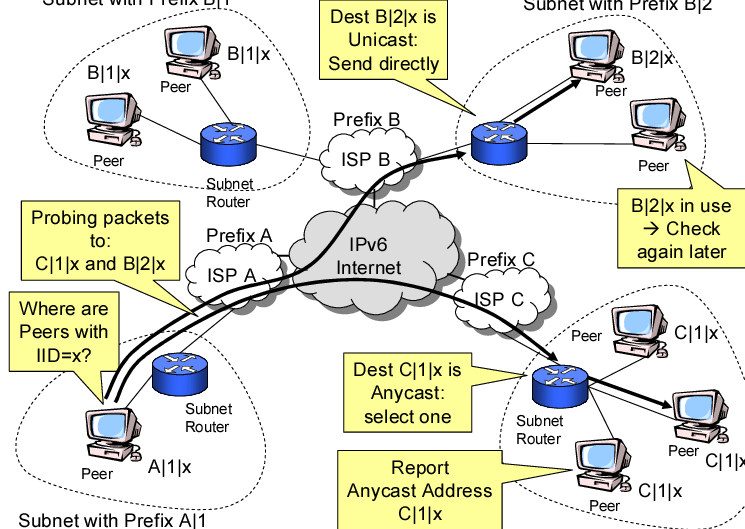
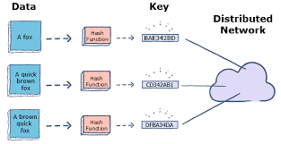

# What is a discovery node?

In the context of Libp2p in Golang, a "discovery node" typically refers to a node that participates in a discovery process to find and connect to other peers in the network. Discovery is an essential aspect of decentralized systems, as it allows nodes to discover and establish connections with their peers dynamically.

Libp2p provides a set of discovery mechanisms, and a discovery node is a peer that actively participates in these mechanisms. These mechanisms help nodes find each other by disseminating information about the network's topology.

Here are some common discovery mechanisms in Libp2p:

MDNS (Multicast DNS): This is a protocol that allows nodes on a local network to discover each other without relying on a centralized server. Nodes announce their presence on the network, and others can listen for these announcements.

Bootstrap Nodes: These are well-known nodes that act as initial points of contact for new nodes entering the network. New nodes can connect to these bootstrap nodes to discover other peers in the network.

DHT (Distributed Hash Table): Libp2p uses a DHT to store and retrieve information about peers in a decentralized manner. Nodes in the network can query the DHT to discover the addresses of other peers.

The role of a discovery node is to participate in one or more of these mechanisms, helping peers find each other and establish connections in a decentralized way. This is crucial for the robustness and scalability of decentralized systems, as it enables nodes to adapt to changes in the network's topology dynamically.