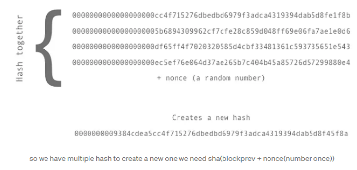
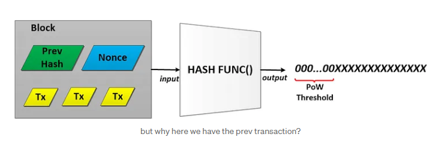
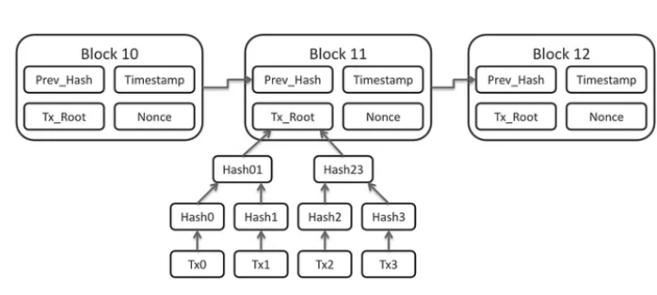

# Mining a block

In this tutorial we will use the most simple and basic way to mine a block.We will use proof of work.


```
sha256("0xs2rgi3p4jfbt43hrjweafwefwff"+0)="t09q3pfoewjaiougt80u9ropijdd"
sha256("0dnoirihp32u823u42o324rwfadsq"+1)="981r03q2ipfout8403qrp2ojiht"
sha256("8q349pjrofioh83409prjfdsfaeoi"+2)="802394qrpjiu58u93q4ropjohir"
sha256("9q0fwei0923rupi0u439rp034u9rr"+3)="fo9432ropeif43092oekr3op32r"
sha256("9r01fhewogr9u3jfeopijot0q49ru"+4)="f43epkfoij5t43pwelmfijwerk3"
sha256("t4280fhpibtqgh0w9pitq4ghgpit4"+5)="p9340ropjiot80932orit43jt09"
----------------------------------------------------------------------
//after a lot of iteration we will get to a hash that looks like this
----------------------------------------------------------------------
sha256("t4280fhpibtqgh0w9pitq4ghgpit4"+123)="000p9340ropjiot80932orit43jt09"
//we have some zeros in the front(we chose the number of zeros 
//so this hash is valid
```


Proof of work is a computational method employed to arrive at a valid solution by repeatedly hashing data until a hash with a specific number of leading zeros is obtained. Achieving multiple leading zeros in a hash is a challenging and low-probability task.



The idea that is present in the code above can expand more, what if we link the transactions with the block? — we concatenate all the content together and apply a hash function on all of them so we will get to a specific number of zeros and that block becomes valid.

In the bottom image we see what is our end goal…so the blocks need to be linked together ( to create a blockchain ). From the bottom image we see that the blocks are linked by the prev hash. And all the transaction are put in a Merkle tree then the root node is added to blockchain.



This is the structure of a block.

```
//block struct
type Block struct {
//is the index of the block ex:0 ,1,2,3
 Index      int      `json:"index"`
//time of the block when is mined
 Timestamp  int64    `json:"timestamp"`
//list of transaction, we will get here later
 Tx         [][]byte `json:"tx"`
//merkle root a byte of the merkle transaction tree
 MerkleRoot []byte   `json:merkle`
//hash of the prevblock
 PrevHash   string   `json:"prevHash"`
//current hash of this block
 Hash       string   `json:"hash"`
//nonce the number that we try to guess when we mine a block
 Nonce      int      `json:"nonce"`
//this is the reward per block
 Reward     int      `json:"reward"`
//this is the current coinbase of the network we grow as the network grows
 Coinbase   int      `json:"coinbase"`
//the miner how mined the block
 Miner      string   `json:"miner"`
}
```

```

func ProofOfWork(address string) types.Block {
	getLastBlockKey := fileop.GetLastKey("db/blocks/blockchain")
	if len(getLastBlockKey) == 0 {
		if getLastBlockKey == nil {
			//fmt.Println("Genesis:", string(getLastBlockKey))
			//create genesis block
			return CreateGenesisBlock(address)
		}
	}
	newBlock := CreateBlock()
	//get private and public key
	_, privateKey := cryptogeneration.GetPublicPrivateKeys()
	//create list of transaction
	var tx []merkletree.Content
	//get all transaction in levelDB
	transaction := fileop.GetAllKeys("db/mempool/valide")
	if len(transaction) != 0 {
		//unmarshall transaction
		for _, v := range transaction {
			data := fileop.GetFromDB("db/mempool/valide", v)
			transactionDB := types.Transaction{}
			json.Unmarshal(data, &transactionDB)
			transactionDB.BlockNumber = newBlock.Index
			//add to list of transaction
			tx = append(tx, transactionDB)
		}
	}

	tx = append(tx, CreateTransaction(privateKey, address, nil, 100, 0, 0))

	//create merkle tree
	merkleTree, _ := merkle.BuildTree(tx)
	listOfTransaction, RootNode := merkle.ExportLeafs(merkleTree)

	newBlock.Tx = listOfTransaction
	newBlock.MerkleRoot = RootNode
	//reconstruct merkle tree from string
	//merkleTree, _ := merkle.ReconstructTree(newBlock.Tx)
	//get merkle tree from string

	iterator := 0
	for {
		newBlock.Nonce = iterator
		storeHash := CalculateHash(newBlock)
		if storeHash[:2] == "00" {
			//fmt.Println("Hash:", storeHash)
			newBlock.Hash = storeHash
			//clear db//mempool/valide
			fileop.EraseAllKeys("db/mempool/valide")
			//fmt.Println("proof_of_work_func:", newBlock)
			return newBlock
			break
		}
		iterator += 1
	}

	return types.Block{}
}
```

Well now we have this block mined so how we will send to other peers(because a blockchain is decentralized( not always)) ?

Up we speak about the channel that we will open to listen to data transfered in the network so… we will have a function that will send that to all the peers that we have stored in our local database.

```
func SendToAllPeers(node host.Host, data []byte, type_to_send int) {
 //read from db all keys
 number := fileop.GetNumberOfKeys("db/peers")
 if number == 0 {
  fmt.Println()
 } else {

  //get all keys from db/peers 
  //here we read all the data from the peers table and 
  //we send the block to every one of this peer
  keys := fileop.GetAllKeys("db/peers")
  fmt.Println("=================")
  //for each key send message
  for i := 0; i < len(keys); i++ {
   fmt.Println(string(keys[i]))
  }
  fmt.Println("================")
  //for each key convert to string
  for i := 0; i < number; i++ {
   peer_addres := string(keys[i])
   //remove \n from string
   //we need \n to read the characters to know where the row of data will end
   peer_addres = peer_addres[:len(peer_addres)-1]
   fmt.Println("Sending to peer: ", peer_addres)
   if type_to_send == 0 {
    //send to blocks channel
    OpenConnectionMine(peer_addres, node, data)
   } else if type_to_send == 1 {
    //send to transaction channel
    OpenConnectionTransaction(peer_addres, node, data)
   }
  }
 }
}
```

Here is the the openConnectionMine function:

```

func OpenConnectionMine(peer_addres string, node host.Host, data []byte) {
//here we will get the address
 addr, err := multiaddr.NewMultiaddr(peer_addres)
 if err != nil {
  println("Error: address format wrong1")
  return
 }
 peer, err := peerstore.AddrInfoFromP2pAddr(addr)
 if err != nil {
  println("Error: address format wrong2")
  return
 }

 if err := node.Connect(context.Background(), *peer); err != nil {
  println("Error: connection failed")
  return
 }
 //we send  a block in this section that was mined 
 //we open a stream to that peer
 stream, err := node.NewStream(context.Background(), peer.ID, "/mine/1.0.0")
 if err != nil {
  //print err
  log.Fatal(err)
  println("Error: stream creation failed")
  return
 }
 fmt.Print("Sending message...")

 //send string to stream
 _, err = stream.Write(data)

 if err != nil {
  println("Error: message sending failed")
  return
 }
}
```