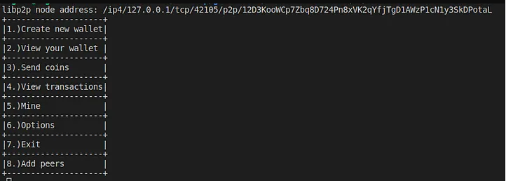

# The terminal

This terminal will be a way to interact with other nodes.l(“complete code will be available on github”)

```
func TerminalView(node host.Host) {
 //print a menu with 8 options
 //1. Create a new wallet
 //2. View your wallet
 //3. Send coins
 //4. View your transactions
 //5. Mine
 //6. Options
 //7. Exit

 theEntireMenu()

 //read data from keyboard
 reader := bufio.NewReader(os.Stdin)
 fmt.Print(">")
 text, _ := reader.ReadString('\n')
 fmt.Println(text)
 //remove \n from text
 text = text[:len(text)-1]
 //verify the input
 switch text {
 case "1":
  createWallet()
 case "2":
  viewWallet()
 case "3":
  sendCoins(node)
 case "4":
  viewTransactions()
 case "5":
  mine(node)
 case "6":
  options()
 case "7":
  exit()
 case "8":
  addPeers(node)
 }

}

func theEntireMenu() {
 fmt.Println("+--------------------+")
 fmt.Println("|1.)Create new wallet|")
 fmt.Println("+--------------------+")
 fmt.Println("|2.)View your wallet |")
 fmt.Println("+--------------------+")
 fmt.Println("|3).Send coins       |")
 fmt.Println("+--------------------+")
 fmt.Println("|4.)View transactions|")
 fmt.Println("+--------------------+")
 fmt.Println("|5.)Mine             |")
 fmt.Println("+--------------------+")
 fmt.Println("|6.)Options          |")
 fmt.Println("+--------------------+")
 fmt.Println("|7.)Exit             |")
 fmt.Println("+--------------------+")
 fmt.Println("|8.)Add peers        |")
 fmt.Println("+--------------------+")
}
```
How will look:



At the top of the terminal, you'll find our P2P address. This address makes it easy to share with other nodes for sending requests.
