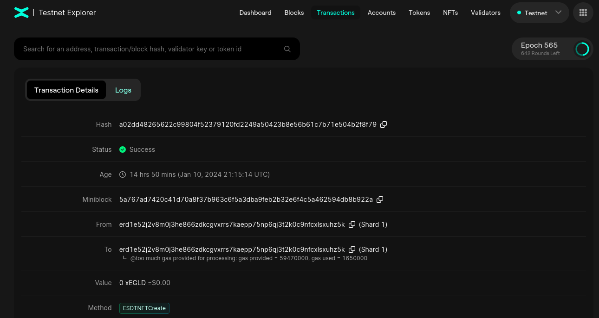
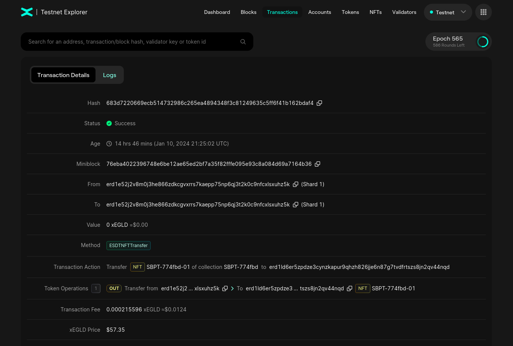
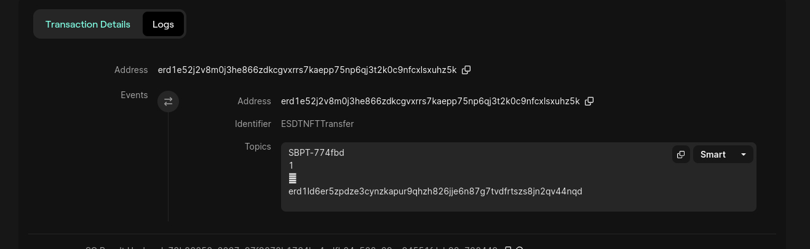
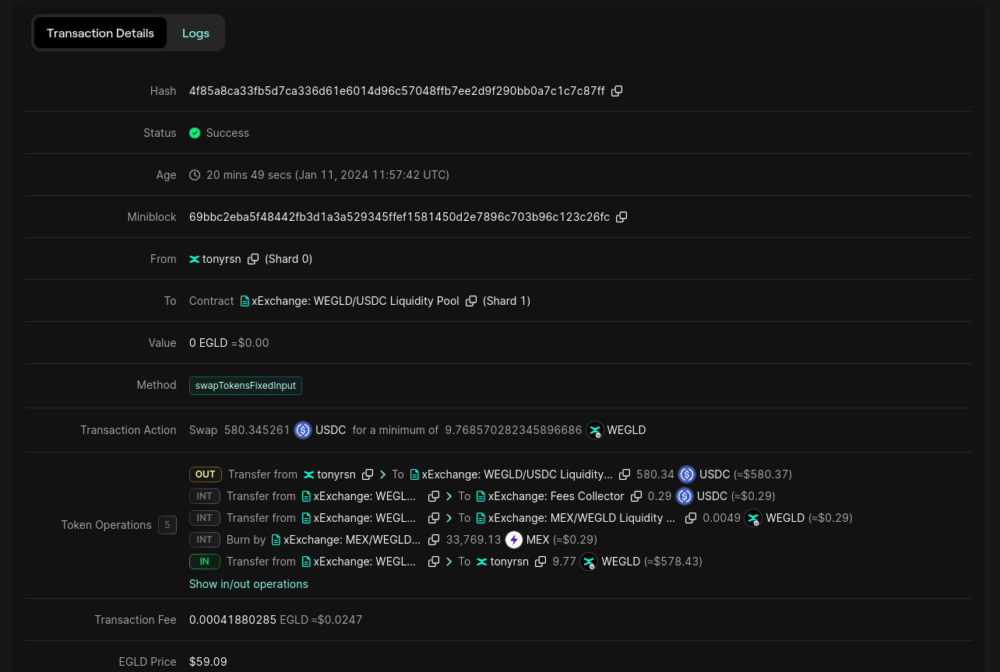
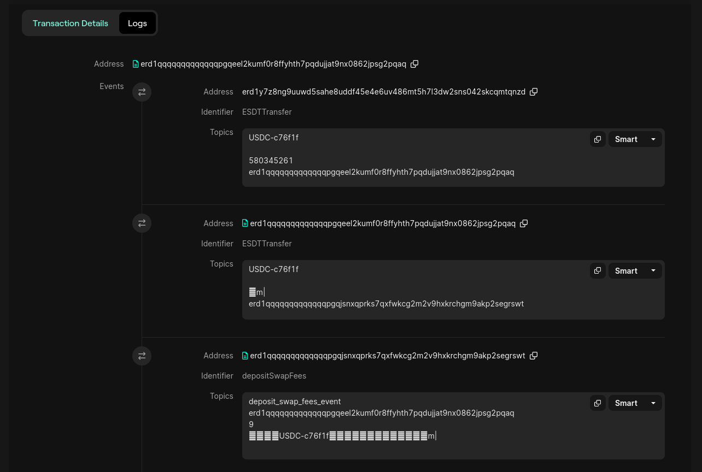
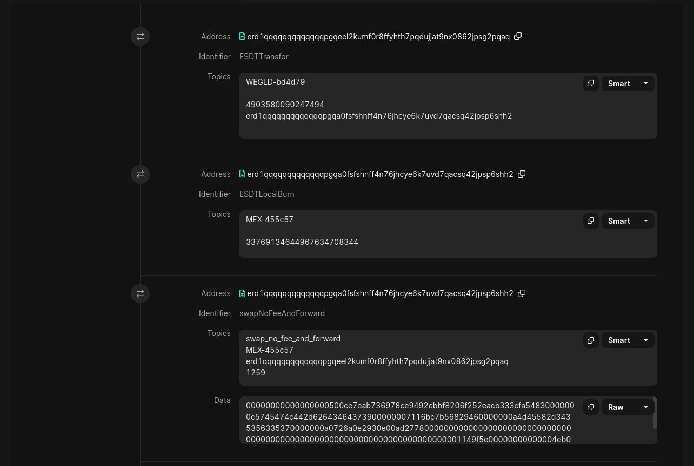

# Events

In this section you will learn what Smart Contract Events are, how to see what events were emitted in a transaction and how to emit one yourself.

Key Takeaways:
* Events in smart contracts serve as a communication mechanism between the contract and user interfaces;
* By emitting events, smart contracts can notify external applications or listeners about specific actions or changes;
* Events play a key role in facilitating effective interaction with user interfaces while ensuring secure automated execution of code-based agreements.

## Example of events

Notice the **Logs** section near the **Transaction Details**.


This section shows all the events this transaction emitted.
Notice that most transactions have this **Logs** section.



Let's open this tab and inspect the Events



Notice there are 4 data fields:
* `SBPT-774fbd` - the token ID;
* `1` - the nonce;
* `1` - the value (the *Smart* display feature doesn't know how to interpret that but the *Decimal* option does);
* `erd1mqa9wttlzwwdvwgk9dzsfdn79lv5raw0tfe9ynvn0dg92hpruvaqhhd2gx` - the destination address.


Let's inspect a more complex operation and check all the log events.
[Here](https://explorer.multiversx.com/transactions/4f85a8ca33fb5d7ca336d61e6014d96c57048ffb7ee2d9f290bb0a7c1c7c87ff) is the link to the transaction.



Notice that the transaction has 4 transfers and 1 burn operations.
Let's inspect the logs:



The first transaction is an `ESDTTransfer` for the token `USDC-c76f1f` which has 6 decimals; therefore *580345261* is equal to *580,345261$*.
You can match the events to the **Token Operations** from the Transacton Details.

You can check the `deposit_swap_fees_event` code [here](https://github.com/multiversx/mx-exchange-sc/blob/e4b95afa68273bab34b4124b711f28af9677e029/energy-integration/fees-collector/src/events.rs#L16).

Notice the burn event below. Keep in mind that `MEX-455c57` has 18 decimals.


[Here](https://github.com/multiversx/mx-exchange-sc/blob/e4b95afa68273bab34b4124b711f28af9677e029/dex/pair/src/events.rs#L202) is the code for the `swap_no_fee_and_forward` event.

## Writing your own event in the Smart Contract

The structure of an event is:
```rust
    #[event("your_event_name")]
    fn the_function_you_call_when_you_want_to_emit_en_event(
        &self,
        #[indexed] field1: &TokenIdentifier,
        #[indexed] field2: &ManagedAddress,
        #[indexed] field3: u64,
        #[indexed] field4: BigUint,
    );
```

And when you want to emit an event, just call the function:
```rust
    self.the_function_you_call_when_you_want_to_emit_en_event(field1, field2, field3, field4);
```

## Task
Last time you interacted with the [ping-pong contract](https://github.com/multiversx/mx-ping-pong-sc). This time, you have to inspect the contract and call an endpoint that emits an event. Don't forget to check the logs!