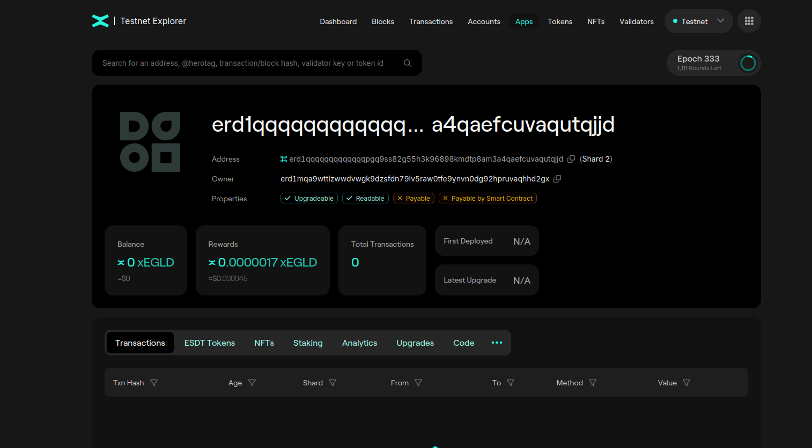

# Smart Contract deployment via Python (mxpy)

Let's deploy our smart contract on the blockchain. For this we will use `mxpy` tools previously installed.
We will deploy the `adder` contract from the previous section.

In the [repo](https://github.com/multiversx/mx-contracts-rs/tree/main/contracts/adder/) there is a folder named [interaction](https://github.com/multiversx/mx-contracts-rs/tree/main/contracts/adder/interaction).

Let's inspect the `testnet.snippets.sh` file:

```bash
ALICE="${USERS}/alice.pem"
ADDRESS=$(mxpy data load --key=address-testnet)
DEPLOY_TRANSACTION=$(mxpy data load --key=deployTransaction-testnet)
PROXY=https://testnet-api.multiversx.com

deploy() {
    mxpy --verbose contract deploy --project=${PROJECT} --recall-nonce --pem=${ALICE} --gas-limit=50000000 --arguments 0 --send --outfile="deploy-testnet.interaction.json" --proxy=${PROXY} --chain=T || return

    TRANSACTION=$(mxpy data parse --file="deploy-testnet.interaction.json" --expression="data['emittedTransactionHash']")
    ADDRESS=$(mxpy data parse --file="deploy-testnet.interaction.json" --expression="data['contractAddress']")

    mxpy data store --key=address-testnet --value=${ADDRESS}
    mxpy data store --key=deployTransaction-testnet --value=${TRANSACTION}

    echo ""
    echo "Smart contract address: ${ADDRESS}"
}

add() {
    read -p "Enter number: " NUMBER
    mxpy --verbose contract call ${ADDRESS} --recall-nonce --pem=${ALICE} --gas-limit=5000000 --function="add" --arguments ${NUMBER} --send --proxy=${PROXY} --chain=T
}

getSum() {
    mxpy --verbose contract query ${ADDRESS} --function="getSum" --proxy=${PROXY}
}
```

This file helps us to easily make deployment and transactions on the blockchain.

First, let's modify the `ALICE` variable and put our own `pem` file.

After that use `source` command or `.` in bash to interpret the file:
```bash
costin@Byblos:~/mvx/mx-contracts-rs/contracts/adder/interaction$ . testnet.snippets.sh 
```

This will load all the variables and functions in the environment.
Now we can call the `deploy` function:
```bash
costin@Byblos:~/mvx/mx-contracts-rs/contracts/adder/interaction$ deploy
DEBUG:cli.contracts:deploy
DEBUG:accounts:AccountBase.sync_nonce()
DEBUG:urllib3.connectionpool:Starting new HTTPS connection (1): testnet-api.multiversx.com:443
DEBUG:urllib3.connectionpool:https://testnet-api.multiversx.com:443 "GET /address/erd1ld6er5zpdze3cynzkapur9qhzh826jje6n87g7tvdfrtszs8jn2qv44nqd HTTP/1.1" 200 363
DEBUG:accounts:AccountBase.sync_nonce() done: 1
INFO:cli.contracts:Contract address: erd1qqqqqqqqqqqqqpgqgjdcmz3049s0g2zwm6dzfrnk5s3qwn8yjn2qltmga4
INFO:utils:View this contract address in the MultiversX Testnet Explorer: https://testnet-explorer.multiversx.com/accounts/erd1qqqqqqqqqqqqqpgqgjdcmz3049s0g2zwm6dzfrnk5s3qwn8yjn2qltmga4
INFO:transactions:Transaction.send: nonce=1
DEBUG:urllib3.connectionpool:Starting new HTTPS connection (1): testnet-api.multiversx.com:443
DEBUG:urllib3.connectionpool:https://testnet-api.multiversx.com:443 "POST /transaction/send HTTP/1.1" 201 106
INFO:transactions:Hash: 09756e622aea6682f8108661270eb0bfe4503fae9ebd1e0253e179daaabbcbe1
INFO:utils:View this transaction in the MultiversX Testnet Explorer: https://testnet-explorer.multiversx.com/transactions/09756e622aea6682f8108661270eb0bfe4503fae9ebd1e0253e179daaabbcbe1
WARNING:cli.data:Always review --expression parameters before executing this command!
WARNING:cli.data:Always review --expression parameters before executing this command!
WARNING:cli.data:Never use this command to store sensitive information! Data is unencrypted.
INFO:cli.data:Data has been stored at key = 'address-testnet', in partition = '*'.
WARNING:cli.data:Never use this command to store sensitive information! Data is unencrypted.
INFO:cli.data:Data has been stored at key = 'deployTransaction-testnet', in partition = '*'.

Smart contract address: erd1qqqqqqqqqqqqqpgqgjdcmz3049s0g2zwm6dzfrnk5s3qwn8yjn2qltmga4
```

Now we have performed a deployment of the wasm binary (our adder contract) in the blockchain.

Notice the _MultiversX Testnet Explorer: https://testnet-explorer.multiversx.com/transactions/09756e622aea6682f8108661270eb0bfe4503fae9ebd1e0253e179daaabbcbe1_.
Click on the link to see your transaction. 

Notice the _Smart contract address: erd1qqqqqqqqqqqqqpgqgjdcmz3049s0g2zwm6dzfrnk5s3qwn8yjn2qltmga4_.
Go to the [Testnet Explorer](https://testnet-explorer.multiversx.com) and search for your SC address.

Notice the contract deployed on testnet:



Observe the fields **Owner**, **Deployed** (timestamp).
