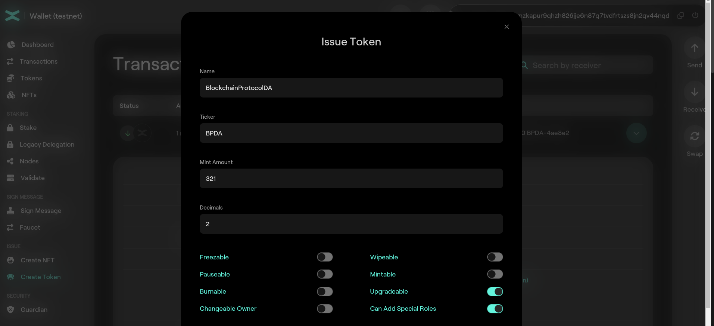
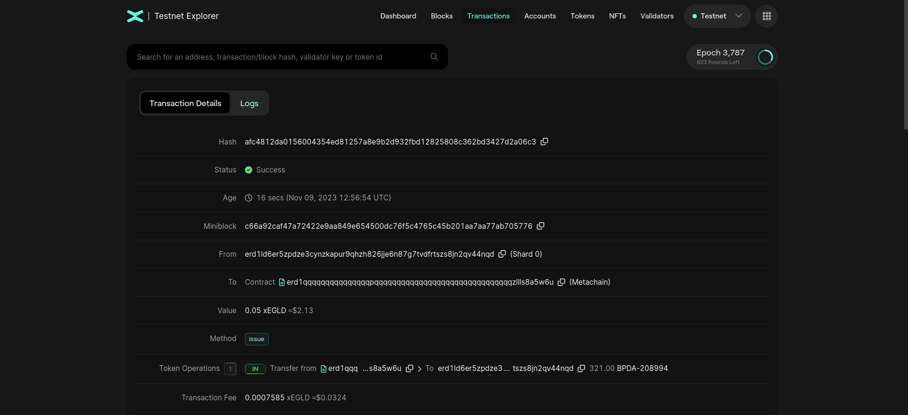
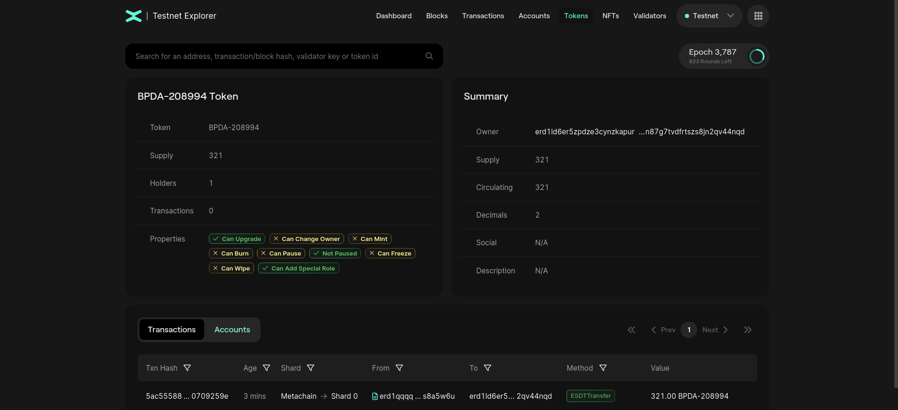
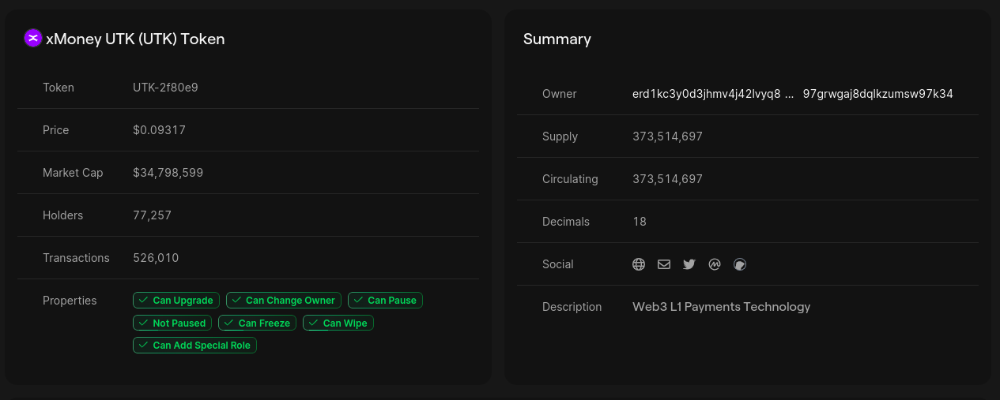

# Fungible Tokens

## Issuance of fungible ESDT tokens via Web Wallet on MultiversX

In this section you will learn how to mint tokens on MultiversX.

There are 2 types of tokens on MultiversX:
* Native tokens - EGLD;
* ESDT - eStandard Digital Token.

In the previous section you learnt how to mint xEGLD on [MultiversX Testnet](https://testnet-wallet.multiversx.com/) using `Faucet` option.


### Mint ESDT via Web Wallet

This time we use the `Create Token` option.

Token Name:
* length between 3 and 20 characters
* alphanumeric characters only

Token Ticker:
* length between 3 and 10 characters
* alphanumeric UPPERCASE only

Number of decimals:
* should be a numerical value between 0 and 18;
* there are no floats on the blockchain;
* a token with 3 decimals and value 1000 would be equal with value 1;
* EGLD has 18 decimals and the value of 1000000000000000000 is 1 EGLD.

Let's create a token new token:



and inspect the transaction 



Observe `Token Operations` field. We received `321.00 BPDA-208994` tokens. `BPDA-208994` is the **token ID**. The token ID is formed by appending to the token ticker the character **-** and 6 random hexadecimals characters. This is done because there might be mutiple tokens with the same ticker; the token ID is always unique.

We can click on the token ID and see the details of the token:



Observe the fields **TOKEN**, **Supply**, **Holders**, **Transactions**, **Owner**, **Decimals**.

Let create another token with the same input:


Observe that the token ID is different.

### Practice

* Create your own ESDT token;
* Inspect the transaction;
* Send some of your tokens to **erd1mqa9wttlzwwdvwgk9dzsfdn79lv5raw0tfe9ynvn0dg92hpruvaqhhd2gx**;
* Create another token with the same ticker. Observer that the token ID is different and unique.

## Issuance of fungible ESDT tokens via cmdline on MultiversX

Throughout the lab, you will need to convert values from decimals to hex to ascii, etc. Use [this](https://utils.multiversx.com/converters) tool to make your job easier.

ESDT tokens are issued via a request to the Metachain, which is a transaction submitted by the Account which will manage the tokens. When issuing a token, one must provide a token name, a ticker, the initial supply, the number of decimals for display purpose and optionally additional properties. The **issuance cost is set to 0.05 EGLD**.

The receiver address **erd1qqqqqqqqqqqqqqqpqqqqqqqqqqqqqqqqqqqqqqqqqqqqqqqzllls8a5w6u** is a built-in system smart contract (not a VM-executable contract), which only handles token issuance and other token management operations, and does not handle any transfers. The contract will add a random string to the ticker thus creating the token identifier. The random string starts with “-” and has 6 more random characters (3 bytes - 6 characters hex encoded). For example, a token identifier could look like **ALC-6258d2**.

Read more about issuance of fungible ESDT tokens [here](https://docs.multiversx.com/tokens/esdt-tokens#issuance-of-fungible-esdt-tokens).

### Issuance example:
```
IssuanceTransaction {
    Sender: <account address of the token manager>
    Receiver: erd1qqqqqqqqqqqqqqqpqqqqqqqqqqqqqqqqqqqqqqqqqqqqqqqzllls8a5w6u
    Value: 50000000000000000 # (0.05 EGLD)
    GasLimit: 60000000
    Data: "issue" +
          "@" + <token name in hexadecimal encoding> +
          "@" + <token ticker in hexadecimal encoding> +
          "@" + <initial supply in hexadecimal encoding> +
          "@" + <number of decimals in hexadecimal encoding>
}
```

### Practice

* Issue a token of your own using `mxpy`. Choose whatever name and ticker you want. Check the existance of your token via [Testnet Explorer](https://testnet-explorer.multiversx.com/).

**Hint:** Use `mxpy --help`

## Mint fungible ESDT tokens via cmdline

---
**NOTE**

Actions **issue** and **mint** are distinct! First, one must **issue** the token to exist on the blockchain. Second, the owner/issuer of the token must **mint** tokens.

---

The transaction to mint tokens is:
```
LocalMintTransaction {
    Sender: <address with ESDTRoleLocalMint role>
    Receiver: <same as sender>
    Value: 0
    GasLimit: 300000
    Data: "ESDTLocalMint" +
          "@" + <token identifier in hexadecimal encoding> +
          "@" + <supply to mint in hexadecimal encoding>
}
```

Note that the sender and the receiver are the same address, which is the creator of the token.
After this transaction, he will receive in his wallet the minted tokens.

### Practice

* Use the token created at the previous section to mint some tokens. Verifiy on the [Testnet Explorer](https://testnet-explorer.multiversx.com/) and in your wallet.

## Setting ESDT Roles

Notice the **Properties** section in a Token page.


There are several roles assigned to a token. 
To change those roles we need to make a blockchain transaction:
```
RolesAssigningTransaction {
    Sender: <address of the ESDT manager>
    Receiver: erd1qqqqqqqqqqqqqqqpqqqqqqqqqqqqqqqqqqqqqqqqqqqqqqqzllls8a5w6u
    Value: 0
    GasLimit: 60000000
    Data: "setSpecialRole" +
          "@" + <token identifier in hexadecimal encoding> +
          "@" + <address to assign the role(s) in a hexadecimal encoding> +
          "@" + <role in hexadecimal encoding> +
          "@" + <role in hexadecimal encoding> +
          ...
}
```

### Practice

* Observe the roles of your newly created token.
* Add **ESDTRoleLocalMint** and **ESDTRoleLocalBurn** for your address.
* Mint 1000 tokens.


You can read more about roles in the [documentation](https://docs.multiversx.com/tokens/esdt-tokens/#setting-and-unsetting-special-roles).

## Burning ESDT Tokens

Anyone that holds an amount of ESDT tokens may burn it at their discretion, effectively losing them permanently. This operation reduces the total supply of tokens, and cannot be undone, unless the token manager mints more tokens.

Do you have roles for burning?

```
LocalBurnTransaction {
    Sender: <address with ESDTRoleLocalBurn role>
    Receiver: <same as sender>
    Value: 0
    GasLimit: 300000
    Data: "ESDTLocalBurn" +
          "@" + <token identifier in hexadecimal encoding> +
          "@" + <supply to burn in hexadecimal encoding>
}
```

### Practice

* Burn 500 tokens


## Other actions for ESDTTokens

### Pausing and Unpausing

The manager of an ESDT token may choose to suspend all transactions of the token, except minting, freezing/unfreezing and wiping. Check more details [here](https://docs.multiversx.com/tokens/esdt-tokens/#pausing-and-unpausing).

### Freezing and Unfreezing

The manager of an ESDT token may freeze the tokens held by a specific Account. As a consequence, no tokens may be transferred to or from the frozen Account. Freezing and unfreezing the tokens of an Account are operations designed to help token managers to comply with regulations. The manager of an ESDT token may choose to suspend all transactions of the token, except minting, freezing/unfreezing and wiping. Check more details [here](https://docs.multiversx.com/tokens/esdt-tokens/#freezing-and-unfreezing).

### Wiping

The manager of an ESDT token may wipe out all the tokens held by a frozen Account. This operation is similar to burning the tokens, but the Account must have been frozen beforehand, and it must be done by the token manager. Wiping the tokens of an Account is an operation designed to help token managers to comply with regulations. The manager of an ESDT token may choose to suspend all transactions of the token, except minting, freezing/unfreezing and wiping. Check more details [here](https://docs.multiversx.com/tokens/esdt-tokens/#wiping).
