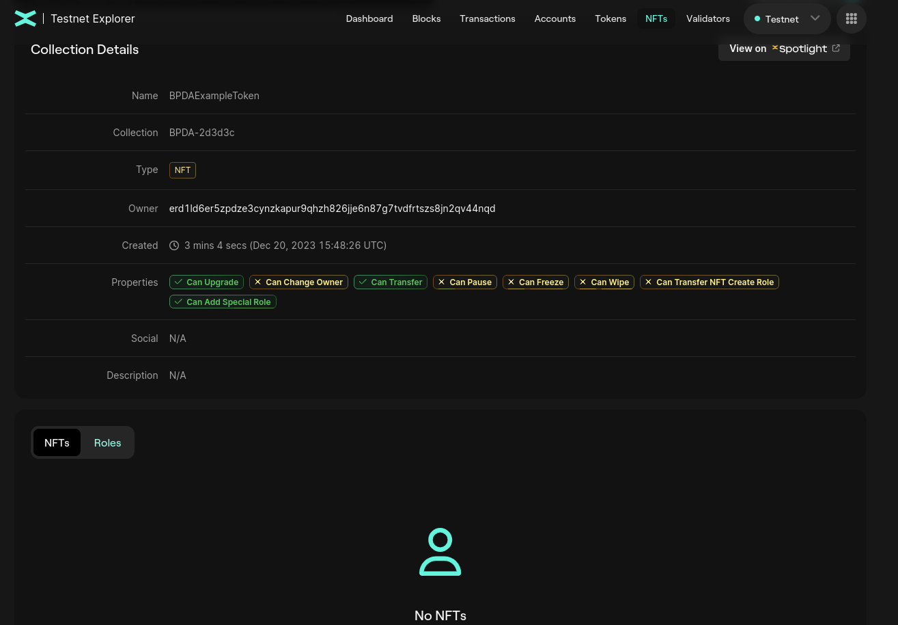
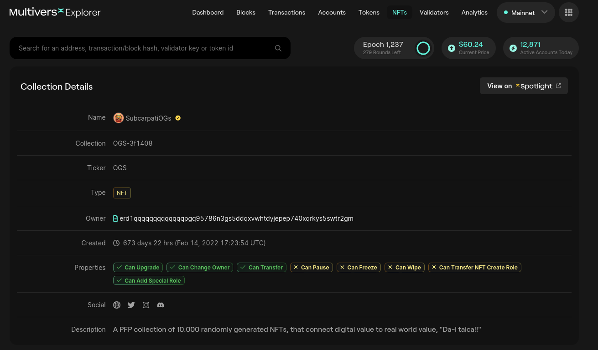

# Non-Fungible Tokens (NFTs)

These NFTs are unique, one-of-a-kind tokens that are built on blockchain technology, allowing for secure ownership and transfer of these assets.
Every token is assigned a unique identification code(ticker) and metadata that distinguishes it from every other token.

The flow of issuing and transferring non-fungible tokens is:
* register/issue the token (this step creates an empty collection);
* set roles to the address that will create the NFT/SFTs;
* create the NFT/SFT;
* transfer quantity(es).


## Issuance of NFT tokens

One has to perform an issuance transaction in order to register a non-fungible token.
Non-Fungible Tokens are issued via a request to the Metachain, which is a transaction submitted by the Account which will manage the tokens.
When issuing a token, one must provide a **token name**, a **ticker** and optionally **additional properties**. This transaction has the form:

```
IssuanceTransaction {
    Sender: <account address of the token manager>
    Receiver: erd1qqqqqqqqqqqqqqqpqqqqqqqqqqqqqqqqqqqqqqqqqqqqqqqzllls8a5w6u
    Value: 50000000000000000 # (0.05 EGLD)
    GasLimit: 60000000
    Data: "issueNonFungible" +
          "@" + <token name in hexadecimal encoding> +
          "@" + <token ticker in hexadecimal encoding>
}

```

Optionally, the properties can be set when issuing a token. Example:

```
IssuanceTransaction {
    Sender: <account address of the token manager>
    Receiver: erd1qqqqqqqqqqqqqqqpqqqqqqqqqqqqqqqqqqqqqqqqqqqqqqqzllls8a5w6u
    Value: 50000000000000000 # (0.05 EGLD)
    GasLimit: 60000000
    Data: "issueNonFungible" +
          "@" + <token name in hexadecimal encoding> +
          "@" + <token ticker in hexadecimal encoding> +
          "@" + <"canFreeze" hexadecimal encoded> + "@" + <"true" or "false" hexadecimal encoded> +
          "@" + <"canWipe" hexadecimal encoded> + "@" + <"true" or "false" hexadecimal encoded> +
          "@" + <"canPause" hexadecimal encoded> + "@" + <"true" or "false" hexadecimal encoded> +
          "@" + <"canTransferNFTCreateRole" hexadecimal encoded> + "@" + <"true" or "false" hexadecimal encoded> +
          "@" + <"canChangeOwner" hexadecimal encoded> + "@" + <"true" or "false" hexadecimal encoded> +
          "@" + <"canUpgrade" hexadecimal encoded> + "@" + <"true" or "false" hexadecimal encoded> +
          "@" + <"canAddSpecialRoles" hexadecimal encoded> + "@" + <"true" or "false" hexadecimal encoded> +
          ...
}
```

### Practice

Let's create our first NFT collection. We will make a transaction to the testnet blockchain via **mxpy** tool.
To install the tool check the [prerequisites section](../../../smart-contracts/lab/content/prerequisites.md).

```bash
costin@Byblos:~$ mxpy contract call erd1qqqqqqqqqqqqqqqpqqqqqqqqqqqqqqqqqqqqqqqqqqqqqqqzllls8a5w6u --pem ~/multiversX/keys/shard0.pem --proxy https://testnet-api.multiversx.com --chain T --recall-nonce --gas-limit 60000000 --value 50000000000000000 --function issueNonFungible --arguments 0x425044414578616d706c65546f6b656e 0x42504441  --send
```

We called that specific contract, signed with my pem to authenticate myself in the blockchain, used testnet proxy and chain, sent 0.05 EGLD, called **issueNonFungible**, using 2 parameters:
* 0x425044414578616d706c65546f6b656e which is the name - **BPDAExampleToken** in hex;
* 0x42504441 which is the ticker - **BPDA** in hex.

Let's check our NFT collection on blockchain:


Observe that the **Collection Name** (which is also known as **token ID**) is `BPDA-2d3d3c`. This is formed using the ticker provided,"-" and 6 random hex numbers.
Also, observe the name **BPDAExampleToken** which is the one we provided.
Lastly, observe that we have an empty collection, with no NFTs. 

### Practice - your turn

* Create an NFT collection.

## Assigning roles to an NFT Collection

Roles can be assigned by sending a transaction to the Metachain from the ESDT manager.
Within a transaction of this kind, any number of roles can be assigned (minimum 1).

```
RolesAssigningTransaction {
    Sender: <address of the ESDT manager>
    Receiver: erd1qqqqqqqqqqqqqqqpqqqqqqqqqqqqqqqqqqqqqqqqqqqqqqqzllls8a5w6u
    Value: 0
    GasLimit: 60000000
    Data: "setSpecialRole" +
          "@" + <token identifier in hexadecimal encoding> +
          "@" + <address to assign the role(s) in a hexadecimal encoding> +
          "@" + <role in hexadecimal encoding> +
          "@" + <role in hexadecimal encoding> +
          ...
}
```

Don't forget to convert the values to hex.
For example, `ESDTRoleNFTCreate = 0x45534454526f6c654e4654437265617465`.


## NFT fields

Below you can find the fields involved when creating an NFT:
* **NFT Name**
    * The name of the NFT or SFT;
* **Quantity** 
    * The quantity of the token. If NFT, it **must be 1**;
    * There are Semi-Fungible Tokens (SFT). You can read more [here](https://docs.multiversx.com/tokens/nft-tokens#nft-and-sft);
* **Royalties** - Allows the creator to receive royalties for any transaction involving their NFT
    * Allows the creator to receive royalties for any transaction involving their NFT;
    * Base format is a numeric value between 0 an 10000 (0 meaning 0% and 10000 meaning 100%)
* **Hash**
    * Arbitrary field that should contain the hash of the NFT metadata;
    * Optional filed, should be left null when building the transaction to create the NFT;
* **Attributes**
    * Represents additional information about the NFT or SFT, like picture traits or tags for your NFT/collection;
    * The field should follow a `metadata:ipfsCID/fileName.json;tags:tag1,tag2,tag3` format;
    * Below you can find a sample for the extra metadata format that should be stored on IPFS:

```
{
  "description": "This is a sample description",
  "attributes": [
    {
      "trait_type": "Background",
      "value": "Yellow",
      "{key}": "{value}",
      "{...}": "{...}",
      "{key}": "{value}"
    },
    {
      "trait_type": "Headwear",
      "value": "BlackBeanie"
    },
    {
      "trait_type": "SampleTrait3",
      "value": "SampleValue3"
    }
  ],
  "collection": "ipfsCID/fileName.json"
}

```
* **URI(s)**
    * **Mandatory** field that represents the URL to a [supported](https://docs.multiversx.com/tokens/nft-tokens#supported-media-types) media file ending with the file extension as described in the [example](https://docs.multiversx.com/tokens/nft-tokens#example) below;
    * Field should contain the Uniform Resource Identifier;


---
**NOTE**

Please note that each argument must be encoded in hexadecimal format with an even number of characters.

---

## Creation of an NFT

A single address can own the role of creating an NFT for an ESDT token. This role can be transferred by using the **ESDTNFTCreateRoleTransfer** function.

An NFT can be created on top of an existing ESDT by sending a transaction to self that contains the function call that triggers the creation. Any number of URIs can be assigned (minimum 1).

```
NFTCreationTransaction {
    Sender: <address with ESDTRoleNFTCreate role>
    Receiver: <same as sender>
    Value: 0
    GasLimit: 3000000 + Additional gas (see below)
    Data: "ESDTNFTCreate" +
          "@" + <token identifier in hexadecimal encoding> +
          "@" + <initial quantity in hexadecimal encoding> +
          "@" + <NFT name in hexadecimal encoding> +
          "@" + <Royalties in hexadecimal encoding> +
          "@" + <Hash in hexadecimal encoding> +
          "@" + <Attributes in hexadecimal encoding> +
          "@" + <URI in hexadecimal encoding> +
          "@" + <URI in hexadecimal encoding> +
          ...
}

```

Additional gas refers to:
* Transaction payload cost: `Data field length * 1500` (GasPerDataByte = 1500);
* Storage cost: `Size of NFT data * 50000` (StorePerByte = 50000).


## Transfer NFT Creation Role

The role of creating an NFT can be transferred by a Transaction like this:
```
TransferCreationRoleTransaction {
    Sender: <address of the current creation role owner>
    Receiver: erd1qqqqqqqqqqqqqqqpqqqqqqqqqqqqqqqqqqqqqqqqqqqqqqqzllls8a5w6u
    Value: 0
    GasLimit: 60000000 + length of Data field in bytes * 1500
    Data: "transferNFTCreateRole" +
          "@" + <token identifier in hexadecimal encoding> +
          "@" + <the address to transfer the role from in hexadecimal encoding> +
          "@" + <the address to transfer the role to in hexadecimal encoding>
}

```

## Change NFT Attributes

An user that has the `ESDTRoleNFTUpdateAttributes`` role set for a given ESDT, can change the attributes of a given NFT/SFT.

---
**NOTE**

`ESDTNFTUpdateAttributes` will remove the old attributes and add the new ones. Therefore, if you want to keep the old attributes you will have to pass them along with the new ones.

---

This is done by performing a transaction like this:

```
ESDTNFTUpdateAttributesTransaction {
    Sender: <address of an address that has ESDTRoleNFTUpdateAttributes role>
    Receiver: <same as sender>
    Value: 0
    GasLimit: 10000000
    Data: "ESDTNFTUpdateAttributes" +
          "@" + <token identifier in hexadecimal encoding> +
          "@" + <NFT or SFT nonce in hexadecimal encoding> +
          "@" + <Attributes in hexadecimal encoding>
}

```

## Transfers

Performing an ESDT NFT transfer is done by specifying the receiver's address inside the Data field, alongside other details.
An ESDT NFT transfer transaction has the following form:

```
TransferTransaction {
    Sender: <account address of the sender>
    Receiver: <same as sender>
    Value: 0
    GasLimit: 1000000 + length of Data field in bytes * 1500
    Data: "ESDTNFTTransfer" +
          "@" + <collection identifier in hexadecimal encoding> +
          "@" + <the NFT nonce in hexadecimal encoding> +
          "@" + <quantity to transfer in hexadecimal encoding> +
          "@" + <destination address in hexadecimal encoding>
}

```

## Branding

Here is `SubcarpatiOGs` NFT Collection.


Observe that there are Social links, a Description and you can even see a Logo.

For branding you NFT collection please read the [instructions](https://docs.multiversx.com/tokens/nft-tokens#branding).